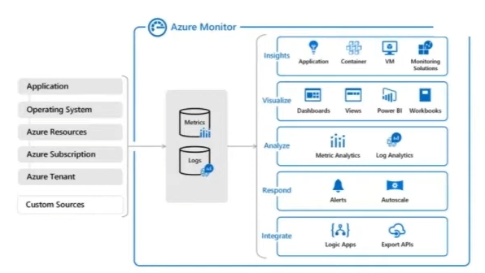

## Azure Monitoring Service

### Azure Advisor
- Azure 관리를 최적화 하기위해 도움을 주는 클라우드 컨설턴드
- 배포된 Azure 리소스를 분석하고 가용성, 보안, 성능 및 가격 개선하는 방벙과 정보를 제공

### Azure Monitor
- 클라우드 및 온 프레미스 환경의 로그 데이터를 활용하여 인사이트, 시각화, 분석, 응답, 통합과 관련된 작업을 할 수 있다.
- Azure Monitor를 활용하면 서비스의 가용성과 성능을 극대화하는데 도움이 되고, 종속된 리소스에 영향을 주는 문제를 사전에 파악할 수 있다.

### Azure Service Health
- Azure Service 상태를 추적하는 대시보드를 제공
- Service Health는 환경 상태에 대한 최신 정보를 제공하며, 서비스의 문제가 사용자에게 영향을 주는 경우 개인 설정 지침 및 지원을 제공하는 도구 모음 환경

### Application Insight
- APM(Application Performance Management) 애플리케이션 성능 관리
- 애플리케이션에서 원격 분석을 통해 작업의 성능 분석을 도와준다.
- Application Insight를 활용해서 클라우드와 온 프레미스에 호스트되는 웹 애플리케이션의 가용성, 성능, 사용량을 모니터링 할 수 있다.

### Activity Log
- 구독 수준의 이벤트에 대한 인사이트를 제공하는 플랫폼 로그로, 구독 리소스 관련 쓰기작업(PUT, POST, DELETE)이 무엇이며 누가 언제 수행했는지에 대한 정보를 제공
- 예를 들어 한 가상머신을 여러명이 쓰고 있는데, 가상머신이 삭제되었을 때 누가 언제 삭제했는지 알 수 있다.

### Log Analytics
- Azure Monitor Logs 에서 수집된 데이터에서 로그 쿼리를 편집 및 실행하고 그 결과를 대화형으로 분석하는 PaaS 형식의 서비스