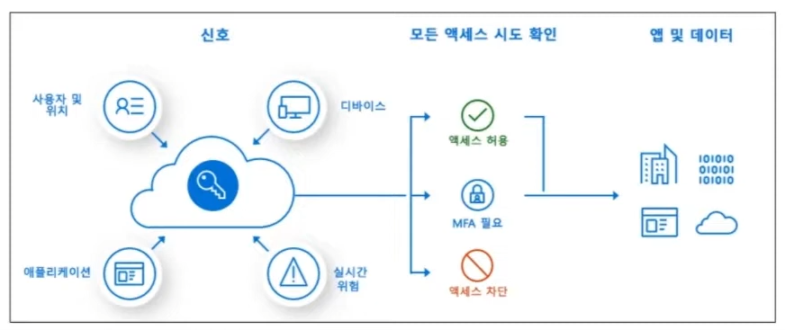
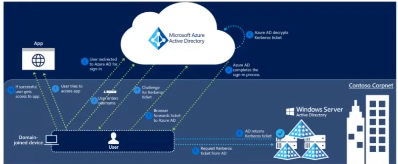

## Azure Identity Service

### Authentication(인증)
- 사용자 자신이 누구인지 증명하는 프로세스
- 합법적인 엑세스 자격 증명을 요청할 때 사용하며, 보안 ID 및 액세스 제어 원칙의 기반이 된다.

### Authorization(권한 부여)
- 인증된 주체에게 작업을 수행할 수 있는 사용 권한을 부여하는 작업

### Azure Active Directory
- Azure AD는 직원들이 로그인하여 다음 리소스에 액세스할 수 있게 해주는 Microsoft의 클라우드 기반 ID 및 액세스 관리 서비스
  - Microsoft 365, Azure Portal, 수천개의 기타 SaaS 애플리케이션 등의 외부 리소스
  - 조직에서 자체 개발한 클라우드 앱과 함께 회사 네트워크와 인트라넷 앱 같은 내부 리소스

### Azure Conditional Access

- IT 관리자가 정의한 조건에 따라 온-프레미스 또는 클라우드 앱을 접근하거나 차단하는 기능
- 다양한 조건 (사용자/그룹별, 앱, 장치상태, 위치, 위험도 등)에 따른 시스템에 대한 액세스를 제어함으로써 업무 시스템에 대한 보안을 강화할 수 있다.

### MFA (Multi-Factor Authentication)
- MFA는 로그인 이벤트 중 사용자에게 추가 형태의 식별을 요구하는 메시지를 표시하는 프로세스
- 해당 프로세스는 휴대폰에서 코드를 입력하거나 지문 검사를 하는 방식이며, 이렇게 인증 형식을 두번 거치게 되면 이 추가 요소는 공격자가 쉽게 얻거나 복제할 수 있는 것이 아니므로 보안이 향상된다.
- OTP 단말기와 같은 개념

### SSO (Single Sign-On)

- SSO는 사용자가 하나의 자격 증명 세트를 사용하여 여러 독립 소프트웨어 시스템에 로그인 할 수 있는 방법
- SSO를 사용하면 사용자는 사용하는 모든 애플리케이션에 로그인할 필요가 없이 모든 애플리케이션에 액세스 할 수 있다.