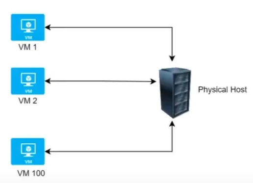

## Azure Security

### Defender for Cloud (구 Azure security Center)
- Azure와 온-프레미스에서 전체 서비스의 보안 태세를 확인할 수 있는 모니터링 서비스
- '보안 태세'는 사이버 보안 정책 및 제어 뿐 아니라 보안 위협을 제대로 예측 및 방지하고 이에 대응할 수 있는 정도를 나타낸다.
- Security Center에서 수행하는 내용
  - 온-프레미스 및 클라우드 워크로드에서 보안 설정을 모니터링 한다.
  - 온라인 상태로 전환되면 필요한 보안 설정을 새 리소스에 자동으로 적용
  - 구성, 리소스, 네트워크에 기반한 보안 권장 사항을 제공
  - 기계학습을 사용하여 맬웨어를 탐지하고 맬웨어가 가상 머신과 기타 리소스에 설치되는 것을 차단.
  - 잠재적인 인바운드 공격을 탐지 및 분석하고, 발생할 수 있는 위협과 위반 후 활동을 조사
  - 네트워크 포트에 대한 Just-In-Time 액세스 제어를 제공, 필요할 때 필요한 트래픽만 네트워크에서 허용하여 공격 노출 영역이 감소하게 한다.

### Azure Key Vault
- 하나의 중앙 위치에 애플리케이션 비밀을 저장하는 중앙집중식 클라우드 서비스
- 비밀을 안전하게 저장하고 액세스하기 위한 클라우드 서비스
- 여기서 비밀은 API 키, 암호, 인증서 또는 암호화 키 등에 대한 액세스를 엄격하게 제어하려는 항목

### Microsoft Sentinel
- 확장 가능한 클라우드 네이티브 SIEM(보안 정보 및 이벤트 관리) 및 SOAR(보안 오케스트레이션 자동화 응답) 솔루션
- 엔터프라이즈 전반에 인텔리전트 보안 분석 및 위협 인텔리전스를 제공하며, 경고 검색, 위협 가시성, 사전 예방적 헌팅 및 위협 대응을 위한 단일 솔루션을 제공

### Azure Dedicated hosts (전용 호스트)

- 하나 이상의 가상머신을 호스트 하는 전용 물리적 서버
- 이 서버는 계정의 워크로드 전용으로 다른 고객과 용량을 공유하지 않는다.