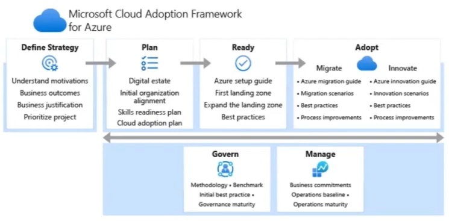

## Azure Governance

### RBAC (Role-based Access Control)
- Azure RBAC(역할 기반 액세스 제어)는 Azure 리소스에 액세스할 수 있는 사용자, 헤당 리소스로 수행할 수 있는 작업 및 액세스 권한이 있는 영역을 관리하는데 도움을 준다.
- Azure RBAC 에서 수행하는 내용
  - 한 사용자는 구독의 가상 머신을 관리하고 다른 사용자는 가상 네트워크를 관리하도록 허용
  - DBA 그룹이 구독의 SQL 데이터베이스를 관리하도록 허용
  - 사용자가 가상 머신, 웹 사이트, 서브넷 등 리소스 그룹의 모든 리소스를 관리하도록 허용
  - 애플리케이션이 리소스 그룹의 모든 리소스에 액세스하도록 허용

### Resource-Locks
- 리소스 잠금을 통해 리소스를 실수로 삭제하거나 수정하는 것을 방지한다.
- 구독, 리소스 그룹 또는 개별 리소스에 잠금을 적용할 수 있고, 잠금 수준을 CanNotDelete 또는 ReadOnly로 설정할 수 있다.
- 상속 잠금
  - 상속 범위에서 잠금을 적용하면 해당 범위 내 모든 리소스가 동일한 잠금을 상속 받는다.
  - 예) 리소스 그룹에 락을 걸면 리소스 그룹 내 리소스들이 삭제되지 않는다.

### Azure Tags
- Azure 리소스, 리소스 그룹, 구독에 태그를 적용해서 논리적인 분류법으로 구성할 수 있다.
- 태그는 리소스에 관한 추가 정보 또는 메타데이터를 제공한다.
  - 메타데이터는 리소스 관리, 비용 관리 및 최적화, 작업 관리, 보안, 거버넌스 및 규정 준수, 워크로드 최적화 및 자동화에 유용

### Azure Blueprints
- Azure Bluepritns를 사용하면 재사용 가능한 정의를 만든 후 리소스 생성 및 정책을 한 번에 적용할 수 있다.
- 기본 제공 도구 및 아티팩트를 사용하여 배포를 감사하고 추적하고 규정 준수를 유지

### Azure Cloud Adoption Framework

- 클라우드 채택 프레임워크는 클라우드 채택 과정을 가속화하도록 설계되고 Microsoft에서 입증된 지침인 설명서, 구현 지침, 모범 사례 및 도구의 모음
- 클라우드 채택 프레임워크를 사용하면 클라우드에서 성공하는데 필요한 비즈니스 및 기술 전략을 만들고 구현할 수 있다.