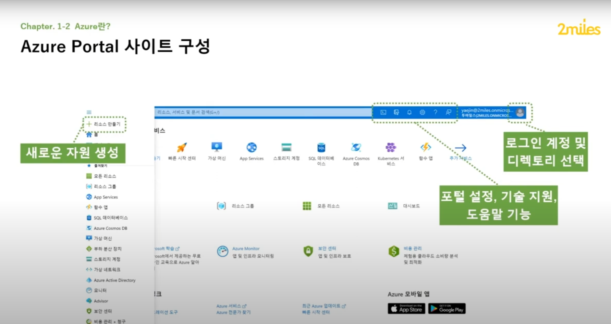

## Azure 란
> Microsoft Azure는 Microsoft에서 관리하는 데이터센터를 통해 애플리케이션과 서비스를 구축, 테스트, 배포 및 관리하기 위해 2010년에 출시된 클라우드 컴퓨팅 서비스

## Azure의 특장점
- 보안(신뢰할 수 있는 클라우드)
  - 다계층 보안을 사용하여 고객과 조직을 보호
  - 포괄적인 규정 준수 범위 활용
  - 데이터 소유
- 하이브리드 클라우드(원활한 하이브리드 운영)
  - 하이브리드 클라우드 플랫폼을 활용하여 유연성 확보
  - 생산적이고 안전하게 원격 작업
  - Azure에서 라이선스 사용
- 다양한 옵션(원하는 대로 빌드)
  - 원하는 언어 및 도구 선택 가능
  - 누구나 사용할 수 있는 AI 제공
  - 제약 조건 없이 빌드 및 스케일링
- 미래를 위한 기술
  - 포괄적인 클라우드 플랫폼을 사용하여 개발
  - AI를 사용하여 비즈니스 혁신 가능
  - 데이터에서 즉각적이고 지속적인 인사이트 얻기

### [Azure 홈페이지](https://azure.microsoft.com/en-us)
- 블로그 탭에 가면 최신 정보를 알아볼 수 있다.
- RSS를 통한 구독하기로 사이트를 방문하지 않아도 이메일을 통해 정보를 확인할 수 있다.

### Azure Portal
- 명령 줄 도구의 대안을 제공하는 웹 기반의 통합 콘솔
  - 간단한 웹 앱에서 복잡한 클라우드 배포까지 모든 것을 구축, 관리 및 모니터링 합니다.
  - 리소스를 편하게 볼 수 있는 사용자 지정 대시보드를 만들 수 있습니다.
  - 사용자에게 필요한 옵션을 구성하여 최적의 환경을 만들 수 있습니다.
- 사이트 구성
  
- Azure Portal Cloud Shell
  - Azure Portal의 Cloud Shell을 클릭하면 포털 화면이 상하로 분할 되며, 하단 Cloud Shell을 통해 각종 리소스 생성 및 관리를 CLI 환경에서 진행할 수 있다.
  - Azure Cloud Shell을 실행하면 구독과 Cloud Shell에서 생성한 자료들을 저장할 스토리지 생성이 진행된다.

### Azure Marketplace
- 마켓플레이스에서 자체 제작한 앱을 판매 가능

## 핵심 Azure 서비스
> 컴퓨팅, 네트워킹, 스토리지, 모바일, 빅데이터, 데이터베이스, 웹, IoT, AI, DevOps

- 컴퓨팅
  - Azure 컴퓨팅은 디스크, 프로세스, 메모리, 네트워킹 및 운영체제와 같은 컴퓨팅 리소스를 통해 클라우드 기반 애플리케이션을 실행하기 위한 주문형 컴퓨팅 서비스
  - Azure 컴퓨팅 서비스 예제
    - Azure Virtual Machines
    - Azure Virtual Machine Scale Sets
    - Azure Kubernetes Service
    - Azure Service Fabric
    - Azure Batch
    - Azure Container Instances
    - Azure Functions 
- 네트워킹
  - 최적의 성능을 위한 최적의 라우팅을 제공. 기본적으로 MS 글로벌 네트워크에 트래픽이 머무는 동안 애플리케이션에 대해 예측 가능하고 대기 시간이 짧은 성능을 제공
  - 보안에 대한 제로 트러스트 접근 방식을 지원하는 서비스로 애플리케이션, 가상 네트워크 및 워크로드를 보호
  - Azure 네트워킹 서비스 예제
    - Azure Virtual Network
    - Azure Load Balancer
    - Azure Application Gateway
    - Azure VPN Gateway
    - Azure Firewall
    - Azure DNS
    - Azure Content Delivery Network
    - Azure DDos Protection
    - Azure Traffic manager
- 스토리지
  - 데이터, 앱 및 워크로드에 대해 대규모로 확장 가능하며 안전한 클라우드 스토리지
  - 뛰어난 스케일링 성능, 보안, 비용 효율성 제공
  - Azure 스토리지 서비스 예제
    - Azure Blob Storage
    - Azure File Storage
    - Azure Queue Storage
    - Azure Table Storage
- 모바일
  - 모든 모바일 디바이스를 위한 애플리케이션을 빠르게 빌드하고 배포할 수 있다.
  - Azure 모바일의 기능
    - 오프라인 데이터 동기화
    - 온-프레미스 데이터 연결
    - 푸시 알람 브로드캐스트
    - 비즈니스 요구 사항과 일치하도록 자동 크기 조절
- 데이터베이스
  - Azure 데이터베이스트트 확장성, 가용성 및 보안을 제공하고, 인프라 관리 자동화를 통해 시간과 비용을 절약할 수 있다.
  - 이를 통해 애플리케이션 빌드에 집중할 수 있게 도와준다
  - Azure 데이터베이스 예제
    - Azure Cosmos DB
    - Azure SQL Database
    - Azure Database for MySQL
    - Azure Virtual Machines의 SQL Server
    - Azure Synapse Analytics
    - Azure Database Migration Service
    - Azure Cache for Redis
    - Azure Database for MariaDB
- IoT
  - 사물 인터넷 또는 IoT는 엣지와 클라우드에서 수십억 개의 IoT 자산을 연결, 모니터링, 제어하는 관리형 서비스 및 플랫폼 서비스의 집합
  - 비즈니스가 IoT 애플리케이션을 빌드, 배포 및 관리하는 데 도움이 되는 데이터 및 분석과 함께 디바이스와 장비의 보안 및 운영 체제도 포함
  - Azure IoT 예제
    - IoT Central
    - Azure IoT Hub
    - IoT Edge
- DevOps
  - 엔드투엔드 지속적인 업데이트 파이프라인을 더 빠르고 안전한게 빌드할 수 있다.
  - 안정적으로 클라우드 모바일 애플리케이션을 빌드, 릴리스, 테스트 및 모니터링 할 수 있다.
  - Azure DevOps 서비스 예제
    - Azure DevOps
    - Azure DevTest Labs

## Azure 계정
- Azure 서비스를 만들고 사용하기 위해서는 Azure 구독이 필요
- Azure를 처음 사용하는 경우, Azure 웹 사이트에서 체험 계정에 가입하여 사용해볼 수 있다.
- 체험 계정의 제한을 초과하여 사용해야하는 경우, 새 구독을 만들어 Azure 서비스에 대한 요금을 지불할 수 있다.
