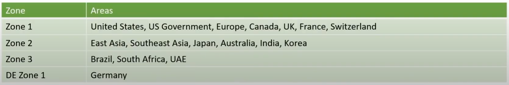
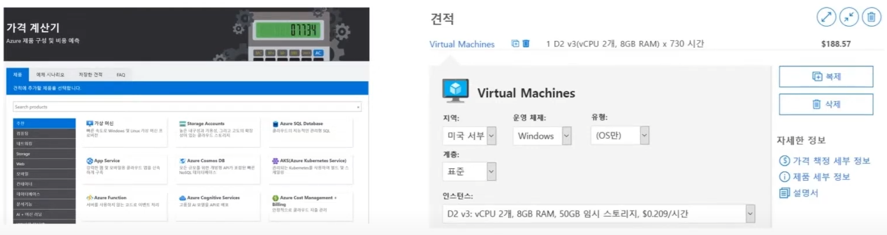

## Azure Pricing

### 비용에 영향을 미치는 요인
- Resource type
  - 리소스마다 비용이 다르기 때문에 Azure는 리소스의 사용량을 추적하는 'meter'를 만든다.
  - meter를 사용하여 사용량 레코드를 생성하며, 생성된 레코드는 나중에 청구서를 만드는데 사용된다. Azure는 항상 사용한 양에 따라 요금이 청구된다.
- Location
  - 각 지역에는 서로 다른 가격이 적용될 수 있다.
- Ingress(Inbound) Network Traffic (무료)
  - 일부 인바운드 데이터 전송(Azure 데이터 센터로 들어오는 데이터)은 무료
- Egress(Outbound) Network Traffic (유료)
  - 아웃바운드 데이터 전송(Azure 데이터 센터에서 나가는 데이터)의 경우 영역에 따라 데이터 전송 가격이 책정
  

### Azure pricing calculator

- 필요한 특정 요구 사항에 따라 구성하고 발생 가능한 비용을 예측
- Azure 서비스와 속성값을 넣으면 서비스별 비용과 **예상 비용**이 산출된다.

### Azure TCO calculator
- TCO 계산기를 사용하여 솔루션을 온-프레미스 데이터 센터 대신 Azure에서 운영하면 얼마만큼의 비용을 절약할 수 있는지 예측할 수 있다.
- 보고서에는 온-프레미스 인프라의 비용과 Azure 제품 및 서비스를 클라우드에서 인프라를 호스트하는데 드는 비용을 비교하고, ROI 정보를 제공한다.

### Cost Management & Billing (비용관리과 청구)
- Microsoft에서 제공하는 도구 모음으로 워크로드 비용을 분석, 관리 및 최적화하는데 도움이 된다.
- Cost Management & Billing으로 수행할 수 있는 작업
  - 청구서 대금 결제와 같은 대금 청구 관리 작업 수행
  - 비용에 대한 청구 액세스 관리
  - 원간 청구서를 생성하는데 사용된 비용 및 사용량 데이터 다운로드
  - 데이터 분석을 비용에 선제적으로 적용
  - 지출 임계값 설정
  - 지출을 최적화할 수 있는 워크로드 변경 기회 포착
#### Billing
- Billing(청구)은 상품이나 서비스에 대한 비용을 고객에게 청구하고 상업적 관계를 관리하는 프로세스 

#### Cost Management
- Cost Management는 고급 분석을 통해 조직의 비용 및 사용 패턴을 보여준다.
- Azure 관리 그룹, 예산 및 권장 사항을 사용하여 지출이 구성되는 방식과 비용을 줄일 수 있는 방법을 명확히 보여준다.
- Azure Advisor보다 한 단계 업그레이드 된 기능을 제공한다.

### Azure 총 비용을 최소화하는 방법들
1. 배포 전 예상 비용 이해하기
   - 선택한 각 항목의 사용량을 측정하고 요금 청구 방법을 알고 있어야 한다.
   - 가격 계산기와 TCO 계산기를 사용하여 예상 비용 계산
   - 솔루션에 필요한 제품, 서비스 및 리소스만 추가
2. Azure Advisor를 사용하여 사용량 모니터링
   - 실제 사용량에 맞게 리소스를 프로비저닝 하는게 좋다.
   - 사용되지 않거나 사용량이 낮은 리소스를 식별하여 제거해도 되는 미사용 리소스를 안내해준다.
3. 지출 한도를 사용하여 지출 제한하기
4. Azure Reservation을 사용하여 선납 (약정 할인)
5. 저렴한 위치의 Azure 지역 선택
6. Azure Cost Management & Billing 을 사용하여 지출 제어
7. 태그를 적용하여 비용 담당자 식별
8. 사용률이 낮은 가상 머신 크기 조정
9. 업무 외 시간에 가상 머신 할당 취소 및 미사용 리소스 삭제