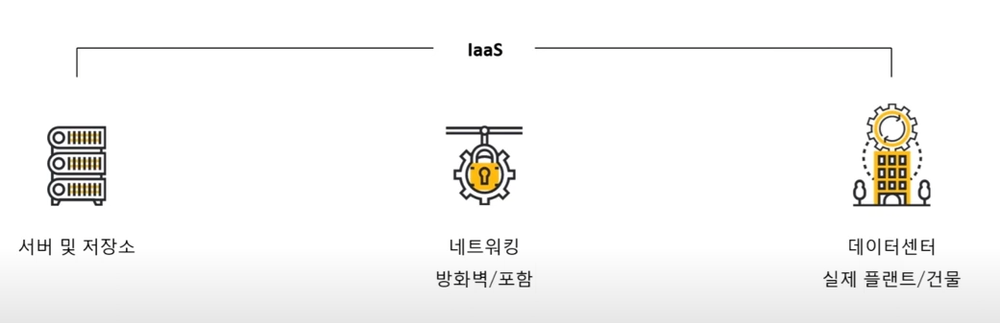
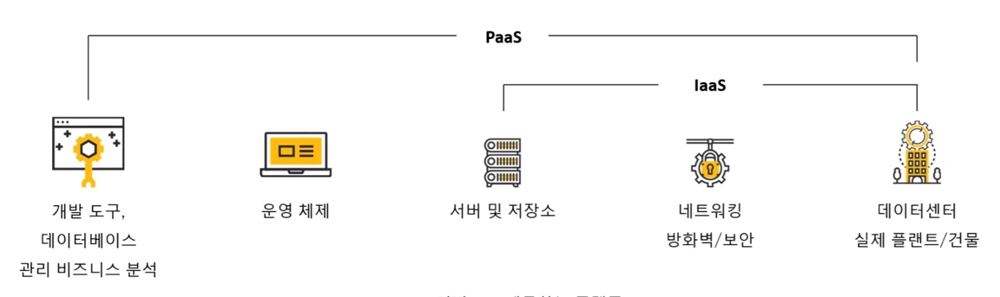
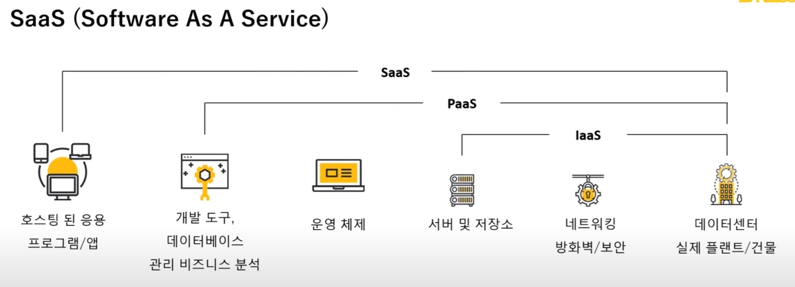
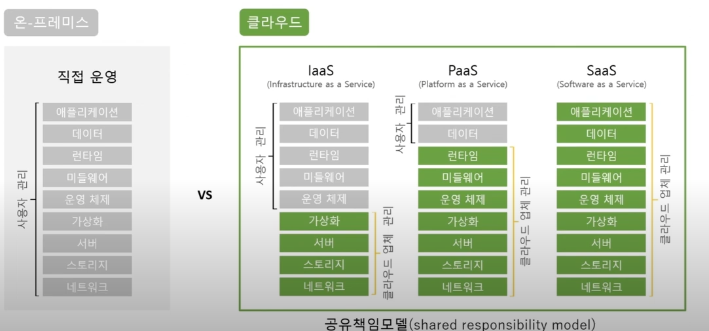

## 클라우드 서비스
### IaaS (Infrastructure As A Service)

- 특징
  - 가상화된 컴퓨팅 리소스(서버, 스토리지, 네트워크)를 제공
  - 사용자가 운영체제(OS), 미들웨어, 애플리케이션을 직접 설치 및 관리
  - 클라우드에서 데이터센터를 운영하는 형태
- 장점
  - 초기 인프라 구축 비용 절감 (필요한 만큼 사용 가능)
  - 유연한 확장성 및 자동 확장 가능
  - 물리적 서버 관리 부담 감소
- 단점
  - 시스템 관리 및 보안 설정을 사용자가 직접 해야 함
  - 네트워크, OS, 데이터 보안 등에 대한 지식 필요
  - 관리 비용이 증가할 수 있음 (사용량 기반 요금제) 

### Paas (Platform As A Service)

- 특징
  - 개발 및 배포 환경(운영체제, 개발 프레임워크, 데이터베이스 등)을 제공
  - 사용자는 애플리케이션 코드 개발 및 실행에 집중 가능
  - 자동화된 인프라 관리 및 확장 지원
- 장점
  - 애플리케이션 개발에 집중 가능 (인프라 관리 부담↓)
  - 자동 확장 및 운영 지원 (배포, 로드 밸런싱 등)
  - 개발 생산성 향상 (다양한 개발 도구 및 환경 제공)
- 단점
  - 플랫폼에 종속될 가능성 있음 (특정 클라우드 환경에서만 실행 가능)
  - 환경 커스터마이징 제한 (IaaS에 비해 세부 설정 자유도가 낮음)
  - 요금이 비쌀 수 있음

### SaaS (Software As A Service)

- 특징
  - 클라우드에서 소프트웨어를 서비스 형태로 제공
  - 사용자는 별도의 설치 없이 웹 브라우저를 통해 사용
  - 소프트웨어 유지보수 및 업데이트는 서비스 제공자가 담당
- 장점
  - 즉시 사용 가능 (설치 및 유지보수 불필요)
  - 낮은 초기 비용 (구독 기반 요금제)
  - 자동 업데이트 및 보안 패치 지원
- 단점
  -  사용자 맞춤형 커스터마이징이 어려움
  -  인터넷 연결이 필수 (네트워크 장애 시 사용 불가)
  -  보안 및 데이터 프라이버시 문제 (데이터가 클라우드에 저장됨)
### 클라우드 서비스 비교

|   | **IaaS** | **PaaS** | **SaaS** |
|---|---|---|---|
| **사용 대상** | IT 관리자, 개발자 | 개발자, DevOps 팀 | 일반 사용자, 기업 |
| **제공 범위** | 인프라(서버, 네트워크, 스토리지) | 개발 및 배포 플랫폼 | 소프트웨어 자체 |
| **관리 책임** | 사용자가 OS, 미들웨어, 앱 관리 | 사용자가 앱만 관리 | 제공자가 모든 것 관리 |
| **유연성** | 높음 (커스터마이징 가능) | 중간 (제한적 환경) | 낮음 (정해진 기능 사용) |
| **비용** | 사용량 기반, 비교적 저렴 | 개발 비용 절감 가능하지만 상대적으로 비쌈 | 구독 요금제, 장기적으로 비용 부담 가능 |
