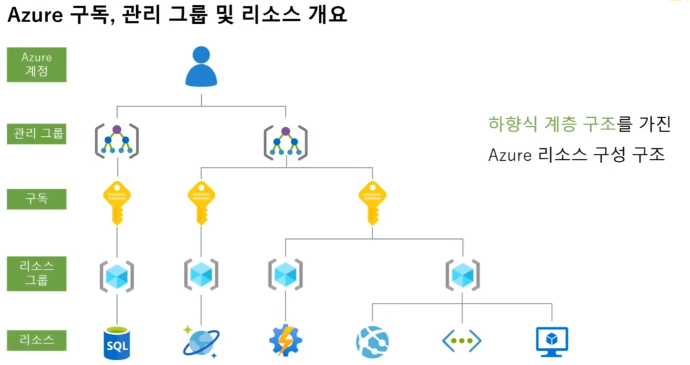
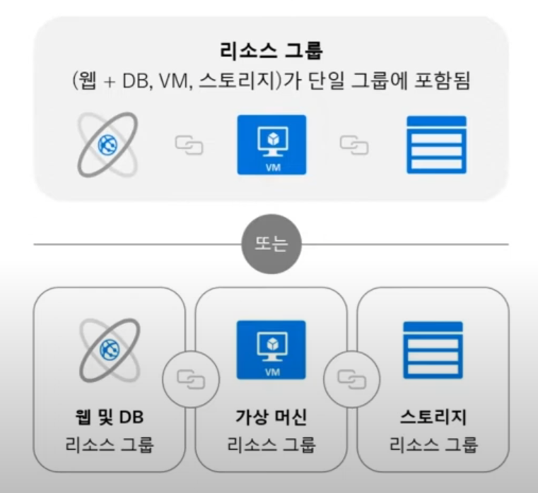
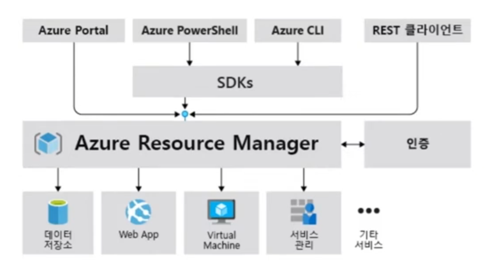

## Azure 리소스 구성 구조

### Azure 핵심 아키텍처 - 리소스/리소스 그룹
- 리소스
  - Azure를 통해 사용할 수 있는 관리 가능한 항목
  - 예) 가상 머신, 스토리지 계정, 웹 앱, 데이터 베이스, 가상 네트워크
- 리소스 그룹
  - Azure 솔루션의 리소스를 보유하는 컨테이너
  - 리소스 그룹에는 그룹으로 관리하려는 리소스가 포함된다.

### 리소스 그룹

- 동일한 수명 주기를 공유하는 여러 리소스에 대한 컨테이너
- 리소스를 단일의 관리 단위로 집계
- 모든 Azure 리소스는 하나의 리소스 그룹에만 존재해야 함
- 리소스 그룹(또는 리소스) 수준에서 RBAC(역할 기반 엑세스 제어)를 사용하여 보호됨
- 리소스 그룹을 삭제하면 그 안에 포함된 모든 리소스도 삭제됨

### Azure 구독
- Azure를 사용하려면 구독이 필요
- 구독은 Azure 제품 및 서비스에 대한 인증 및 권한 부여된 액세스를 제공한다.
- 구독은 사용자 계정과 해당 사용자 계정에서 만든 리소스를 그룹화한다.
- 각 구독에 대해 만들고 사용할 수 있는 리소스 양에 대한 제한 또는 할당량이 있다.
- 구독을 사용하여 사용자, 팀 또는 프로젝트에서 만든 리소스 및 비용을 관리할 수 있다.

### Azure 관리 그룹
- 여러 구독에 대한 액세스, 정책 및 규정 준수를 관리하는데 도움이 된다.
- 관리 그룹에 속하는 모든 구독은 관리 그룹에 적용되는 조건을 자동으로 상속한다.

### Azure 리소스 매니저

- 리소스 관리자 : Azure용 배포 및 관리 서비스
- 사용자가 Azure 도구, API, 또는 SDK에서 요청을 보내면 리소스 매니저가 요청을 받는다.
- 요청을 인증하고 권한을 부여한다.
- 리소스 매니저는 요청된 작업을 수행하는 Azure 서비스에 요청을 보낸다.
- 모든 요청이 동일한 API를 통해 처리되어 다양한 도구에서 일관된 결과와 기능을 볼 수 있다.