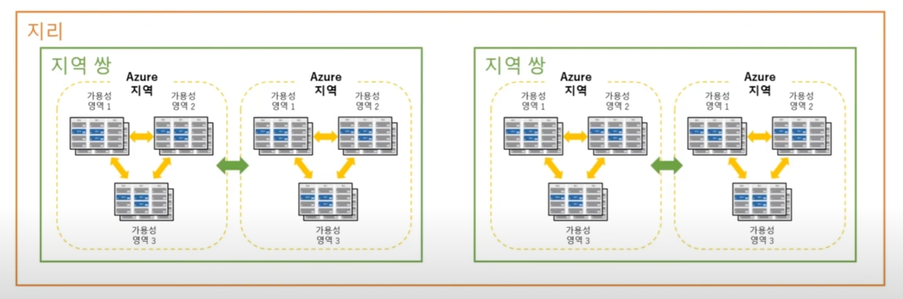

## 지역, 지리, 가용성 영역, 지역 쌍

### 지역 (Region)
- 지역은 데이터 센터의 컬렉션
- 유연성 및 확장성 제공
- 데이터 보존 준수
- 사용자와 가까운 지역을 선택
- 지역별로 독립적인 글로벌 서비스 존재

### 지리 (Geography)
- 일반적으로 둘 이상의 지역을 포함
- 데이터 상주 및 규정 준수 경계를 보존하는 개별 시장
- 특정 데이터 상주 및 컴플라이언스 요구 사항이 있는 고객이 데이터 및 애플리케이션을 근접하게 유지하도록 함
- 큰 범주의 지리적 위치는 아메리카, 유럽, 아시아 태평양, 중동, 아프리카로 나뉘며, 큰 범주 내 세부 지리가 포함됨

### (가용성) 영역 (Availability Zone)
- 지역 내에 하나 이상의 데이터센터를 가진 물리적 위치를 뜻함
- 하나의 지역 내 하나 이상의 영역이 존재함
- 각 영역 간의 대기시간은 2ms 이하를 보장
- 데이터센터의 오류나 손상을 대비해 서비스의 논리적 격리화 중복성, 내결함성을 제공

### 지역 쌍 (Region Pair)
- 각 Azure 지역은 다른 지역과 쌍으로 연결된다.
- Azure는 지역 쌍의 데이터 센터를 483km 이상 분리
- 일부 서비스는 쌍으로 연결된 지역으로의 자동 복제를 제공한다.
- 정신이 발생하는 경우 모든 지역 쌍에서 한 지역이 먼저 복구된다.

> 한국의 경우 남부, 중부에 LG 유플러스와 KT 데이터센터를 임차해 사용하고 있다.

### 가용성 집합 (Availability set)
- 중복성과 가용성을 제공하는 VM의 논리적 그룹의 개념
  - 업데이터 도메인(UD) : 예약된 유지 관리, 성능 또는 보안 업데이트는 업데이트 도메인을 통해 순서가 정해진다.
    - 업데이트시 오프라인이 아니더라도 자동 수행되는 도메인
  - 장애 도메인(FD) : 데이터 센터의 여러 하드웨어에서 워크로드를 물리적으로 분리
    - 장애 발생시 Failover로 데이터 손실 방지 및 최소화를 도와준다.
    - Failover : 컴퓨터 서버, 시스템 네트워크 이상시 예비시스템으로 자동전환되는 시스템