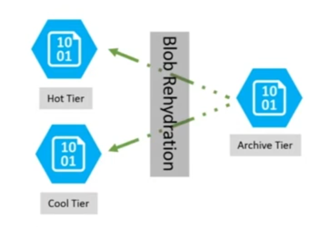

## Azure Storage Service

- Blob(Binary Large Object)
  - 대용량 바이너리 데이터를 저장하기 위한 데이터 유형
  - 보통 이미지, 동영상, 오디오, PDF, 실행 파일 등과 같은 비정형 데이터를 데이터베이스나 클라우드 스토리지에 저장할 때 사용

### Azure Blob Storage
> AWS의 S3 와 같은 개념
- 클라우드용 개체 스토리지 솔루션
- 방대한 양의 데이터를 저장할 수 있다.
- Azure Blob Storage 옵션
  - 액세스계층
    - HOT Tier
      - 스토리지 데이터에 자주 접근해서 작업해야 하는 경우 사용
    - Cool Tier
      - 저장한 데이터에 접근이 자주 발생하지 않을 때 사용 (비용 절감)

### Azure Blob Rehydration

- Blob은 보관 액세스 계층에 있지만 오프라인으로 간주되어 읽거나 수정할 수 없다.
- 보관된 Blob에서 데이터를 읽거나 수정하려면 Blob을 Hot 또는 Cool 온라인 계층으로 변경해야 한다.
  - Blob Rehydration을 통해서 보관된 데이터를 읽을 수 있다. 
  - 두가지 방법
    - 보관된 Blob을 온라인 계층에 복사
    - Blob의 액세스 계층을 온라인 계층으로 변경

### Azure Files Storage
> AWS의 EFS와 같은 개념
- Azure Files는 클라우드에서 산업 표준 SMB(서버 메시지 블록) 및 네트워크 파일 시스템 프로토콜을 통해 액세스할 수 있는 완전 관리형 파일 공유를 제공한다.
- Azure Files를 사용하는 경우
  1. 여러 온-프레미스 애플리케이션에서 파일 공유를 할 때
  2. 구성 파일을 파일 공유에 저장하고 여러 가상 머신에서 액세스 할 때

### Azure Queue Storage
- 메시지를 저장하고 검색하는데 사용

### Azure Table Storage
- 비관계형 구조화된 데이터를 저장하는 서비스로, 스키마 없이 디자인된 키/특성 저장소를 제공
- 스키마가 없기 때문에 애플리케이션의 요구 사항이 변화함에 따라 데이터를 쉽게 적응시킬 수 있다.