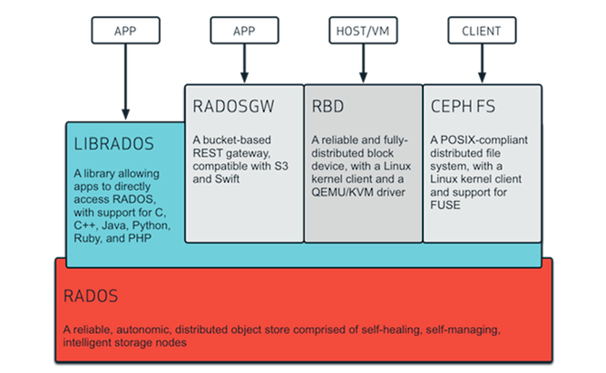
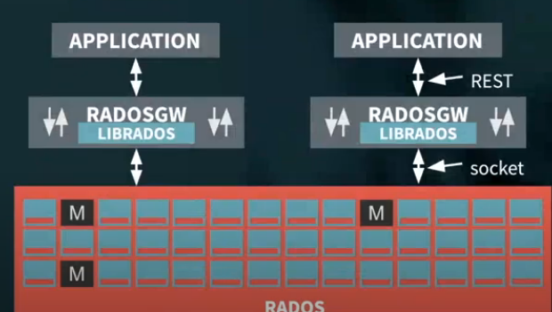
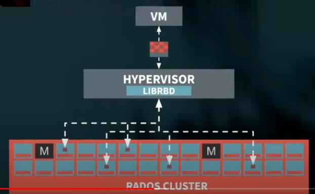

## Ceph 기본

>  Ceph 이란?
>
> - 단일 분산 컴퓨터 클러스터에 오브젝트 스토리지를 구현한 오픈소스 스토리지 플랫폼


### Ceph 기본 구성



- 출처 : http://www.valltera-tech.com/vt_ceph.html

#### RADOS (Reliable Autonomic Distributed Object Store)

- 자가치유, 자가관리 기능이 있는 분산 오브젝트 스토어
- ceph의 기반이 되는 cluster로, 실질적인 데이터가 저장되는 곳
- osd, monitor, manager 등이 올라간다.
- osd, mon 으로 기본 구성되며 사용하는 스토리지 타입에 따라 MDS, RGW를 추가적으로 사용

#### LIBRADOS

- app이 rados에 직접적으로 접속할 수 있도록 허용해준다.
- HTTP 오버헤드 없이 app에서 RADOS에 대한 액세스를 할 수 있게 지원해준다.
- RADOS cluster와 socket 방식으로 통신한다.

#### RADOSGW(gate-way)

- `object storage`를 위한 gate-way로 S3 및 swift와 호환된다.
- 아래의 그림과 같이, S3 요청이 들어오면 RADOSGW는 librados에게 전달한다



#### RBD(Rados Block Device) 

- 우리가 사용중인 스토리지 방식

- 데이터 분실을 최소화하며 분산된 블록 스토리지를 구현
- 아래 그림 처럼 `Openstack`으로 구축된 클라우드 환경에서 vm에서 블록 스토리지에 access 요청이 일어나면 하이퍼바이저에서 해당 request를 `librbd`로 전달한다.
- `Openstack`뿐 아니라 다른 오픈소스들과도 함께 사용 가능

​				

#### CEPHFS 

- ceph file storage


#### OSD (Object Storage Daemon)

- 데이터를 저장하고, replication이나 recovery, rebalancing을 수행한다.
- Ceph OSD 데몬들의 heartbeat를 Ceph Monitors and Managers에 제공해준다.
- 하나의 osd는 하나의 disk에 올라간다. 3개 이상 구성하는 것을 추천


#### Monitor

- Cluster와 각종 map(monitor map, manager map, OSD map, MDS map, CRUSH map)과 같은 상태정보를 구성한다.
- 위의 사항들을 체크하여 요청을 어떻게 보낼지 판단한다.
- 홀수의 monitor를 두어 쿼럼을 하도록 한다.
  - 쿼럼(Quorum) : 클러스터의 분할로 스플릿 브레인이 발생하는 것을 방지하기 위해 사용하는 알고리즘으로, 각 노드로부터 투표를 받아 운영노드를 결정하는 것을 뜻한다.
- 데이터 자체는 다루지 않는다.


#### Manager

- lumious 버전 부터 등장한 데몬
- external monitoring과 management를 위해 추가적인 인터페이스를 제공한다.
- manager framework interface를 통해 다양한 모듈과의 호환성을 높일 수 있다.ㄴ


#### CRUSH (Controlled Replication Under Scalable Hashing)

- client측에서 해당 object를 이용하기 위해 어떤 osd에 접근할지 알아야하는데, 이에 대한 정보를 제공하는 알고리즘이다.
- 접근 방식(object storage, block storage, ceph file system 등)에 상관없에 모두 crush 알고리즘을 사용한다.


#### PGs (Placement Groups)

- 100개가 넘는 osd에 걸쳐 복제되어 있는 수 많은 object들을 관리하는 것은 힘들다. 이를 PG로 손쉽게 다룰 수 있다.
- pg 계산
  - object가 저장된 osd를 탐색하기 위해서는 pool을 placement group이라는 sub device로 나눈다.
  - 총 PG = (osd * 100) / pool


#### Ceph monitoring 명령어

```
ceph -s                                      // Ceph 상태 확인 
ceph health detail                           // ceph cluster 상태 확인 - 자세히
ceph -w                                      // Ceph Cluster 상태 실시간 확인
ceph df                                      // cluster 사용량 확인
ceph df detail                               // ceph cluster 사용량 확인 - 자세히
ceph pg dump                                 // pg 상태 확인
ceph mon dump                                // ceph monitor 상태 확인
ceph mgr dump                                // ceph manager 상태 확인
ceph osd dump                                // ceph osd 상태 확인
ceph osd tree                                // osd map 정보 tree 형식으로 출력
ceph osd df                                  // osd별 사용량 확인
ceph osd pool ls                             // osd pool 리스트 확인
ceph auth list                               // keyring 정보 출력 
rados df                                     // pool 통계 정보
```