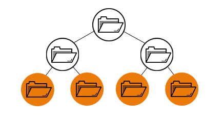
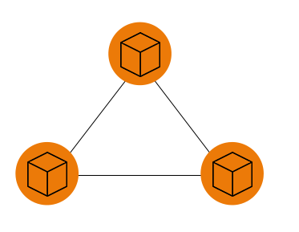
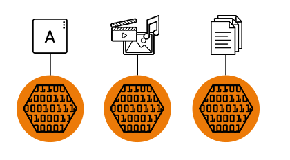

# 데이터 스토리지(Data Storage)

> 데이터 스토리지란?
>
> - 애플리케이션, 네트워크 프로토콜, 문서, 미디어, 주소록, 사용자 기본 설정 등을 구성하는 세부 데이터인 `디지털 정보`를 실제로 수집하고 보관하는 곳

### 데이터 스토리지 종류

- 파일 스토리지
- 블록 스토리지
- 오브젝트 스토리지.

#### 파일 스토리지

- 파일 기반의 스토리지로, 일반적으로 흔히 알고 있는 스토리지
- 서류철에 서류를 정리하듯, 데이터가 폴더 안에 단일 정보로 저장된다.
- 해당 데이터에 액세스해야 하는 경우, 컴퓨터는 그 데이터를 찾기위해 경로를 알아야 한다.
  - 경로가 길고 찾기 어려울 수 있음

#### 블록 스토리지

- 데이터를 블록 단위로 나눈다. 즉, 데이터를 별도의 조각으로 분리해 저장하는 것
- 각 데이터 블록은 고유 식별자를 부여받는데, 이는 스토리지 시스템이 더 작은 데이터 조각을 원하는 곳에 배치할 수 있도록 해준다.
  - 일부 데이터는 `Linux`환경에 저장하고 일부는 `Windows`장치에 저장할 수 있다는 뜻
- 데이터를 사용자 환경에서 분리해 이를 쉽게 활용할 수 있도록 다양한 환경 전반에 분산하도록 설정되는 경우가 많다. 그런 후 데이터가 요청되면 기본 스토리지 소프트웨어가 이러한 환경의 데이터 블록을 다시 조합해 사용자에게 제공한다.
- 파일 스토리지와는 달리 단일 경로에 의존하지 않으므로 신속하게 검색할 수 있다.
- 각 블록은 독립적으로 존재하며 파티션으로 분할될 수 있어서 서로 다른 운영체제에 액세스 할 수 있다.
- 비용이 많이 들고 메타데이터를 처리하는 기능이 제한적이다.

#### 오브젝트 스토리지

- 파일들이 작게 나뉘어 여러 하드웨어에 분산되는 평면적 구조
- 데이터는 오브젝트라 불리는 개별 단위로 나뉘며, 서버의 블록이나 폴더에 파일을 보관하는 대신 단일 리포지토리에 보관된다.
- 볼륨은 모듈 단위로 동작하고, 각각은 독립적인 리포지토리이며 데이터, 오브젝트가 분산 시스템에 존재하도록 허용하는 고유 식별자, 그리고 해당 데이터를 설명하는 메타데이터를 보유한다.
- 오브젝트에는 충분한 양의 정보가 있어서 애플리케이션이 신속하게 데이터를 검색할 수 있으며, 비정형 데이터를 저장하기에도 좋다
- 오브젝트는 수정이 불가능하다. 따라서 오브젝트 작성을 한번에 완료해야 한다.

- 참고
  - https://www.redhat.com/ko/topics/data-storage/file-block-object-storage