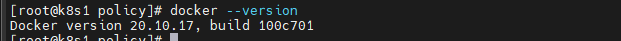

## Centos에 도커 설치하기

- Centos 7 기준으로 작성되었습니다.


```bash
# docker install
yum install docker

# Docker service 실행
service docker start

# 부팅시 자동 실행 설정
chkconfig docker on
```

- 위 방법으로 도커를 설치하였을 때에는 `1.13.1` 버전이 설치 되었고, docker image를 push 할때 에러가 발생하였다. 그래서 최신 버전으로 도커를 설치하는 방법을 찾아봤다


#### 도커 최신버전 설치

1. Docker 구버전 삭제

```
$ yum remove docker \
             docker-client \
             docker-client-latest \
             docker-common \
             docker-latest \
             docker-latest-logrotate \
             docker-logrotate \
             docker-engine
```

2. Docker 설치

   1. yum-utils 설치, repository  등록

   ```
   $ yum install -y yum-utils
   ```

   2. Docker 레파지토리 등록

   ```
   $ yum-config-manager --add-repo https://download.docker.com/linux/centos/docker-ce.repo
   ```

   3. Docker 최신버전 설치

   ```
   $ yum install docker-ce docker-ce-cli containerd.io -y
   ```

   - 설치 결과

   


#### 버전 설정해서 Docker 설치

```
$ yum list docker-ce --showduplicates | sort -r
```

- 위 명령어로 설치 가능한 docker 버전을 확인 후 설치하면 된다

```
$ yum install docker-ce-<VERSION_STRING> docker-ce-cli-<VERSION_STRING> containerd.io
```

- ex

```
$ yum install docker-ce-20.10.5-3.el7 docker-ce-cli-20.10.7-3.el7 containerd.io
```


- 참고
  - https://ksr930.tistory.com/145