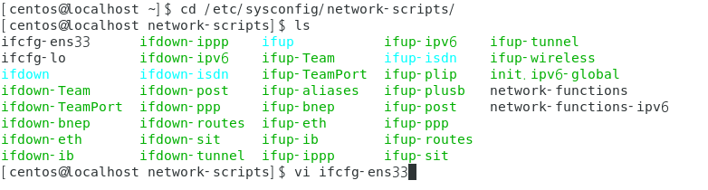
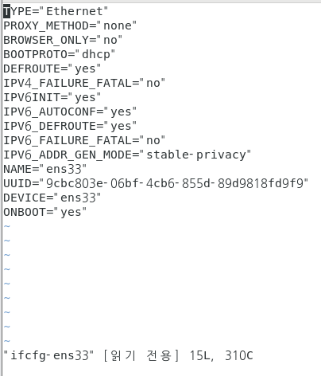

## Linux IP 변경

#### Centos7 기준으로 작성하였습니다.

1. 현재 IP 확인

```
$ ifconfig
혹은
$ ip a
```

2. 이더넷 카드 수정

```
$ cd /etc/sysconfig/network-scripts/
$ vi ifcfg-ens33  # 각자 환경에 따라 다를 수 있음 ls명령어로 확인
```



- 이더넷 카드가 ens33으로 설정되어 있는 것을 확인할 수 있다. eth0 와 같이 다른 이름으로 되어있을 수도 있음

  

수정 전 초기 화면


- 수정

```
BOOTPROTO -> "static" 으로 변경
UUIP 주석처리

# 추가
IPADDR=192.168.x.x
GATEWAY=192.168.x.x
PREFIX=24
DNS1=8.8.8.8
```

- 수정을 할 때는 insert키를 누른 후 하면 되고 수정이 완료되면 esc를 누른 후 :wq 를 치고 엔터를 누르면 된다


3. network restart

```
$ systemctl restart network
```

수정을 한 뒤에는 네트워크를 다시 시작해줘야 한다.