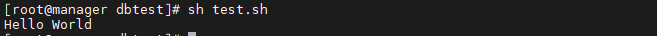
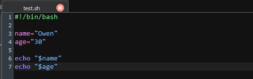
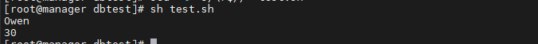
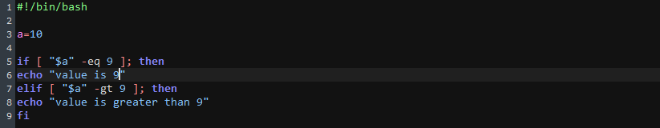
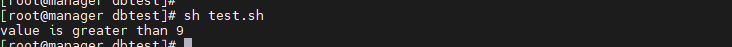

## Shell

> Shell(쉘)은 운영체제상에서 사용자가 입력하는 명령을 읽고 해석하여 대신 실행해주는 프로그램이다. 커널과 사용자 사이를 이어주는 역할을 하는 명령어 해석기.

- Linux에서 사용하는 Shell 종류
  - bash : 가장 대표적으로 사용
  - sh
  - csh
  - ksh
  - tcsh

### Shell Script란?

- Shell Script란 Shell에서 사용할 수 있는 명령어들의 조합을 모아서 만든 batch 파일이다.
- 즉, Shell을 이용하여 한 줄씩 순차적으로 읽으면서 명령어들을 실행시켜주는 인터프리터 방식의 프로그램이다.

####  Shell Script 기본 구조

- 첫번째 줄에 `#!/bin/bash`를 적어준다.
  - Unix 계열 Shell Script 파일의 필수적인 부분, Shebang이라고도 부름
  - 해당 파일을 해석해줄 인터프리터의 절대경로를 지정해주는것. 여기서는 bash를 Shell의 인터프리터로 지정한 것

```shell
#!/bin/bash
echo "Hello World"
```

- 실행 결과




#### Shell Script 기본 문법

##### 변수

- 예시



- 결과



- 대소문자 구문 함, 띄어쓰기 (X)


##### if 문

```bash
if[조건]; then ... elif[조건]; then ... else ... fi 문
```

- 예시



- 결과



- Shell Script `if문`에 사용되는 조건문

```
[ -z ] : 문자열의 길이가 0이면 참
[ -n ] : 문자열의 길이가 0이 아니면 참

[ -eq ] : 값이 같으면 참
[ -ne ] : 값이 다르면 참
[ -gt ] :  값1 > 값2
[ -ge ] : 값1  >= 값2
[ -lt ] : 값1 < 값2
[ -le ] : 값1 <= 값2

[ -a ] : &&연산과 동일 and 연산
[ -o ] : ||연산과 동일 xor 연산

[ -d ] : 파일이 디렉토리면 참
[ -e ] : 파일이 있으면 참
[ -L ] : 파일이 심볼릭 링크면 참
[ -r ] : 파일이 읽기 가능하면 참
[ -s ] : 파일의 크기가 0 보다 크면 참
[ -w ] : 파일이 쓰기 가능하면 참
[ -x ] : 파일이 실행 가능하면 참

[ 파일1 -nt 파일2 ]  : 파일1이 파일2보다 최신파일이면 참
[ 파일1 -ot 파일2 ]  : 파일1이 파일2보다 이전파일이면 참
[ 파일1 -ef 파일2 ] : 파일1이 파일2랑 같은 파일이면 참
출처: https://jink1982.tistory.com/48 [돼민이:티스토리]
```


- 참고
  - https://jink1982.tistory.com/48
  - https://minkwon4.tistory.com/159