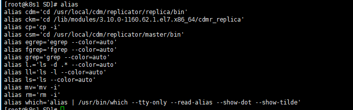

## alias

> alias는 별칭이라는 뜻으로 리눅스에서 alias는 사용자가 명령어를 다른 이름으로 바꿔서 사용할 수 있는 내부 명령어를 뜻한다.
>
> - 자주 사용하는 긴 명령어는 alias를 통해 간결하게 만들 수 있다.


####  alias 확인

```
$ alias
```

- 현재 등록된 alias 리스트를 확인 할 수 있다.



- 이미 우리가 자주 사용하는 명령어들도 alias에 있는것을 확인할 수 있다.


