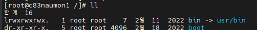

## 리눅스 파일

#### 리눅스 파일의 종류

- 일반 파일 `-`

  - 데이터를 저장하는데 주로 사용
  - 각종 테스트 파일, 실행 파일, 이미지 파일 등 리눅스의 대부분 파일은 일반 파일이다.
  - 실행 파일이나 이미지 파일의 경우 데이터가 바이너리 형태로 저장되어 있기 때문에 vi나 cat 명령어를 사용할 수 없다.

- 디렉토리 `d`

  - 쉽게 말하면 폴더인데 리눅스에서는 디렉토리도 파일이다.
  - 디렉토리에 저장된 파일 또는 하위 디렉토리에 대한 정보가 저장된다.

- 링크 파일 `l`

  - 원본 파일을 대신해서 원본 파일을 다른 파일이른으로 지정한 것. 윈도우의 바로가기 폴더와 비슷하다.
  - 하드링크는 `l`로 표시 되지 않는다. 심볼릭 링크만 표시된다.

  

- 특수 파일(블록형 장치 파일 `b`, 문자형 `c`, 파이프 `p`, 소켓 `s`)

  - 리눅스에서는 하드디스크 같은 장치들도 파일로 취급한다.
  - 각종 device를 관리하기 위해 시스템 관리자는 해당 device 파일로 접근해야 한다.
  - 장치파일은 /dev 디렉토리 아래에 있다.
  - 예시
    - b - 디스크 파일 `/dev/sda`
    - c - 입출력 콘솔 파일 `/dev/console`
    - p - 파이프 파일 `/run/systemd/initctl/fifo`
    - s - 소켓 파일  `/dev/log`

#### 참고 

- https://it-serial.tistory.com/19