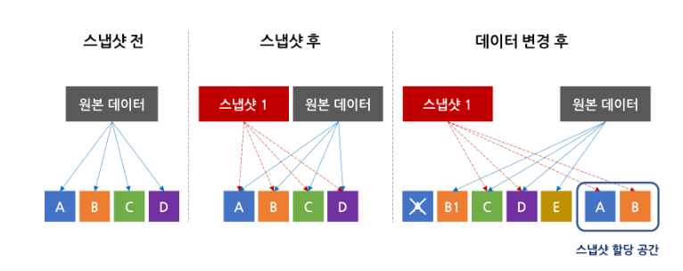
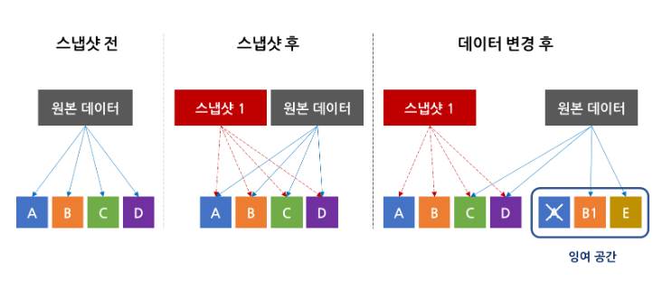
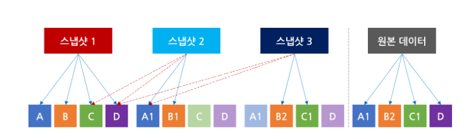

# 스냅샷(Snap shot)

### 스냅샷이란?

- 특정 시간에 파일시스템을 복사해서 보관하다가 나중에 원본에 문제가 생겼을 때 복원을 해주는 기능

- 스토리지에 저장된 데이터를 과거 시점으로 되돌릴 수 있다.

---

### 스냅샷과 백업의 차이

- 원본 데이터 종속성 (**가장 큰 차이점**)
  - 스냅샷 : 원본의 완벽한 복사가 아니기 때문에 원본 데이터가 저장된 공간에 오류가 발생할 경우 복구가 불가능
  - 백업 : 데이터 전체를 완전한 형태의 사본으로 복제해 저장하기 때문에 백업된 시점의 데이터 전체를 완벽하게 복구할 수 있다.
- 하드웨어 벤더 종속성
  - 스냅샷 : 스토리지 하드웨어 벤더를 변경하는 경우 이전 스토리지에 있는 스냅샷을 활용할 수 없다.
  - 백업 : 하드웨어를 변경하게 되어도 백업 데이터를 활용할 수 있어 벤더 종속성으로부터 자유롭다.
- 작업에 따른 부하 및 소요 시간
  - 스냅샷
    - 전체 데이터를 복제하지 않기 때문에 스냅샷 생성 및 데이터 복원에 소요되는 시간이 획기적으로 단축
    - 수정이 필요한 부분의 원본 데이터만을 입력해두기 때문에 전체를 복제하는 백업보다 성능상의 오버헤드를 줄일 수 있음
    - 빈번한 업데이트를 진행하는 경우 스냅샷이 적합

---

### 스냅샷 종류

#### Split-mirror 스냅샷

- 스냅샷 설정 시 원본 데이터를 통째로 복제하는 방식(가장 단순한 형태)
- 장점
  - 저장 방식과 구조가 단순하다.
  - 원본에 문제가 생겼을 경우 다시 통째로 복원이 가능하다.
- 단점
  - 다른 스냅샷과 비교했을 때 공간 효율이 떨어진다.
  - 데이터 양이 커질수록 스냅샷의 생성속도가 느려진다.

#### Copy-on-write 스냅샷

- 의미 그대로 write가 있을 때 copy를 하기 때문에 실질적인 데이터 처리는 데이터가 변경되는 시점에 이루어진다.

- 원본 데이터에 대한 메타데이터만 활용해 스냅샷을 생성하고, 추후 원본 데이터에 수정이 필요할 때 해당 데이터를 스냅샷이 저장된 스토리지 공간으로 복사한다.

- 장점
  - 즉각적으로 스냅샷을 생성할 수 있다.
  - 변경되지 않은 데이터는 포인터로 지정해 놓기만 하면 되기 때문에 split-mirror 방식에 비해 데이터 이동이 적다
- 단점
  - 데이터가 변경될 때마다 CPU와 I/O에 부하가 발생한다.
    - SSD티어링을 사용하면 어느정도 완화 가능

#### Redirect-on-write 스냅샷

- COW 방식에 비해 스토리지와 CPU의 오버헤드를 줄일 수 있는 스냅샷 방식
- 변경되는 데이터를 여분의 공간에 직접 쓰기를 진행해, 복사-붙이기 과정 하나를 생략할 수 있음
- write 발생 시 redirect(새로운 공간으로 위치를 재지정)하는 것을 의미

- 장점
  - COW와는 다르게 새로 변경된 데이터의 쓰기 작업을 한번만 진행하면 되기 때문에 부하가 훨씬 덜 발생
- 단점
  - 스냅샷을 삭제하는 경우 수정된 데이터의 포인터를 재설정하는데 추가적인 리소스 발생
  - 스냅샷을 여러개 생성할수록 포인터가 복잡해짐

#### Incremental(증분) 스냅샷

- 스냅샷 생성 이후에 변경되는 데이터만 새로운 스냅샷에 계속 기록하는 방식
  - 스냅샷1에 저장된 데이터 A, B, C, D에서 A와 B가 수정되었으면 수정된 A1과 B1이라는 데이터만 스냅샷2에 저장, 수정되지 않은 C, D는 스냅샷1에서 참조. 스냅샷 3에서 B1과 C가 수정되면 스냅샷 3에는 수정된 데이터 B2와 C1만 저장되고, 나머지는 스냅샷 1과 2에서 참조.

- 장점
  - 스냅샷을 생성할 때마다 스토리지 공간을 매우 적게 소모하기 때문에 다른 방식에 비해 스냅샷을 빠르고 자주 생성할 수 있음

---

### Linux file system

- EXT
- XFS
- ZFS
- BTRFS

### XFS

- 실리콘 그래픽스(SGI)가 만든 고성능 저널링 파일 시스템(high-performance journaling file system)
- 

#### 특징

- CentOS 7버전부터 기본 지원되는 파일 시스템
- 많은 병렬 I/O 스트림을 처리할 수 있다.
- 대역폭을 쉽게 확장할 수 있고, 동시에 여러 장치에서 작업해도 성능이 저하되지 않는다.
- 

### Reflink

- XFS에 새로운 실험적 기능, 사용자가 파일 간에 데이터 블록을 공유 할 수 있도록 했음
- 커널 수준 지원이 필요하기 때문에 비교적 최근 릴리스에서만 사용가능하다. 
- Copy-On-Write 방식을 주로 지원한다.

---

### 스냅샷의 활용

> 

#### 참고 자료

- https://tech.gluesys.com/blog/2020/12/16/storage_7_intro.html
- https://pkalever.wordpress.com/2016/01/22/xfs-reflinks-tutorial/
- https://blogs.oracle.com/linux/post/xfs-data-block-sharing-reflink