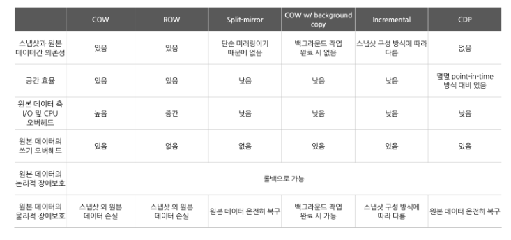
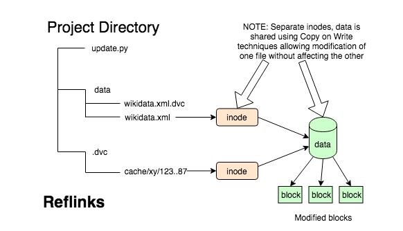
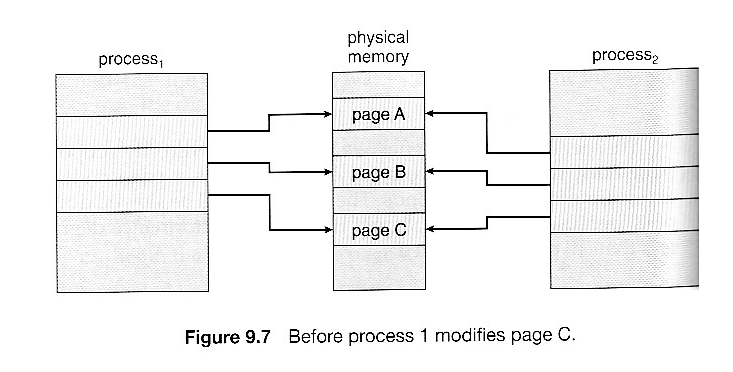
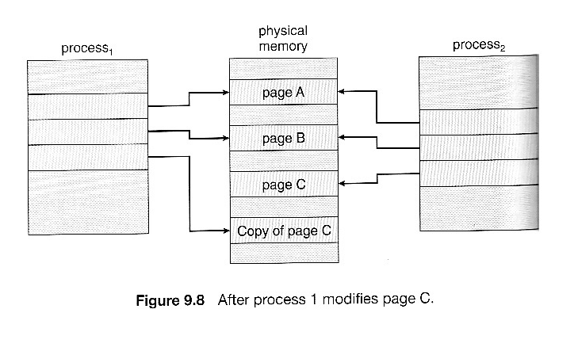

# 스냅샷(Snap shot)

### 스냅샷이란?

> - 특정 시간에 파일시스템을 복사해서 보관하다가 나중에 원본에 문제가 생겼을 때 복원을 해주는 기능
>
> - 스토리지에 저장된 데이터를 과거 시점으로 되돌릴 수 있다.

---

### 스냅샷과 백업의 차이

- 원본 데이터 종속성 (**가장 큰 차이점**)
  - 스냅샷 : 원본의 완벽한 복사가 아니기 때문에 원본 데이터가 저장된 공간에 오류가 발생할 경우 복구가 불가능
  - 백업 : 데이터 전체를 완전한 형태의 사본으로 복제해 저장하기 때문에 백업된 시점의 데이터 전체를 완벽하게 복구할 수 있다.
- 하드웨어 벤더 종속성
  - 스냅샷 : 스토리지 하드웨어 벤더를 변경하는 경우 이전 스토리지에 있는 스냅샷을 활용할 수 없다.
  - 백업 : 하드웨어를 변경하게 되어도 백업 데이터를 활용할 수 있어 벤더 종속성으로부터 자유롭다.
- 작업에 따른 부하 및 소요 시간
  - 스냅샷
    - 전체 데이터를 복제하지 않기 때문에 스냅샷 생성 및 데이터 복원에 소요되는 시간이 획기적으로 단축
    - 수정이 필요한 부분의 원본 데이터만을 입력해두기 때문에 전체를 복제하는 백업보다 성능상의 오버헤드를 줄일 수 있음
    - 빈번한 업데이트를 진행하는 경우 스냅샷이 적합

---

### 스냅샷 종류

#### Split-mirror 스냅샷

> 스냅샷 설정 시 원본 데이터를 통째로 복제하는 방식(가장 단순한 형태)

- 장점
  - 저장 방식과 구조가 단순하다.
  - 원본에 문제가 생겼을 경우 다시 통째로 복원이 가능하다.
- 단점
  - 다른 스냅샷과 비교했을 때 공간 효율이 떨어진다.
  - 데이터 양이 커질수록 스냅샷의 생성속도가 느려진다.

#### Copy-on-write 스냅샷

> 의미 그대로 write가 있을 때 copy를 하기 때문에 실질적인 데이터 처리는 데이터가 변경되는 시점에 이루어진다.
>
> - 가장 널리 쓰이는 스냅샷 방식 중 하나
> - 원본 데이터에 대한 메타데이터만 활용해 스냅샷을 생성하고, 추후 원본 데이터에 수정이 필요할 때 해당 데이터를 스냅샷이 저장된 스토리지 공간으로 복사한다.
> - **Reflink에 쓰이는 방식**

- 원리
  - 위의 그림처럼 스냅샷 1을 생성하면 스냅샷이 원본 데이터 A, B, C, D의 위치를 가리키고 있는데, 이를 포인터(pointer)라고 합니다. 이 포인터를 통해 스토리지의 파일시스템이나 컨트롤러가 데이터를 추적할 수 있습니다. 여기서 데이터가 수정되는 경우, COW 스냅샷에서는 원본 데이터를 미리 할당해 놓은 스냅샷 공간(20% 정도)에 복제해 놓고 새로 수정된 데이터를 기존 위치에 덮어씁니다.

- 장점
  - 즉각적으로 스냅샷을 생성할 수 있다.
  - 변경되지 않은 데이터는 포인터로 지정해 놓기만 하면 되기 때문에 split-mirror 방식에 비해 데이터 이동이 적다
- 단점
  - 데이터가 변경될 때마다 CPU와 I/O에 부하가 발생한다.
    - SSD티어링을 사용하면 어느정도 완화 가능

#### Redirect-on-write 스냅샷

- COW 방식에 비해 스토리지와 CPU의 오버헤드를 줄일 수 있는 스냅샷 방식
- 변경되는 데이터를 여분의 공간에 직접 쓰기를 진행해, 복사-붙이기 과정 하나를 생략할 수 있음
- write 발생 시 redirect(새로운 공간으로 위치를 재지정)하는 것을 의미

- 원리

  - 이해를 돕기 위해 위 그림과 같이 이전처럼 데이터 A와 B가 변경되고, 데이터 E가 생성되는 경우를 예시로 설명해 드리고자 합니다. 데이터 변경이 확인되면 삭제되는 데이터 A에 대한 정보와 변경되는 데이터 B, 그리고 추가되는 데이터 E를 여분의 공간에 바로 쓰기 작업을 진행합니다. 여기서 원본 데이터가 저장된 기존 공간은 그대로 스냅샷을 위한 공간이 됩니다.

    이 방법은 COW와는 다르게(읽기 1회, 쓰기 2회) 새로 변경된 데이터의 쓰기 작업을 한번만 진행하면 되기 때문에 부하가 훨씬 덜 발생하게 됩니다. 이 때문에 최근에는 주류였던 COW 대신 ROW 스냅샷을 이용하는 경우가 많아지고 있습니다. 다만, 스냅샷을 삭제하는 경우 수정된 데이터의 포인터를 재설정하는데 추가적인 리소스 비용이 발생하게 됩니다. 또한, 스냅샷을 여러 개 생성할수록 포인터가 복잡해지는 경우가 있습니다.

- 장점

  - COW와는 다르게 새로 변경된 데이터의 쓰기 작업을 한번만 진행하면 되기 때문에 부하가 훨씬 덜 발생

- 단점
  - 스냅샷을 삭제하는 경우 수정된 데이터의 포인터를 재설정하는데 추가적인 리소스 발생
  - 스냅샷을 여러개 생성할수록 포인터가 복잡해짐

#### Incremental(증분) 스냅샷

- 스냅샷 생성 이후에 변경되는 데이터만 새로운 스냅샷에 계속 기록하는 방식
  - 스냅샷1에 저장된 데이터 A, B, C, D에서 A와 B가 수정되었으면 수정된 A1과 B1이라는 데이터만 스냅샷2에 저장, 수정되지 않은 C, D는 스냅샷1에서 참조. 스냅샷 3에서 B1과 C가 수정되면 스냅샷 3에는 수정된 데이터 B2와 C1만 저장되고, 나머지는 스냅샷 1과 2에서 참조.

- 장점
  - 스냅샷을 생성할 때마다 스토리지 공간을 매우 적게 소모하기 때문에 다른 방식에 비해 스냅샷을 빠르고 자주 생성할 수 있음

### 스냅샷 비교

---

### Linux file system

- EXT
- XFS
- ZFS
- BTRFS

### XFS

> 실리콘 그래픽스(SGI)가 만든 고성능 저널링 파일 시스템(high-performance journaling file system)
>
> - CentOS 7버전부터 기본 지원되는 파일 시스템

#### 신뢰성

- 메타데이터 저널링: 시스템을 다시 시작할 때 재생할 수 있는 파일 시스템 작업 기록을 유지하고 파일 시스템을 다시 마운트하여 시스템 충돌 후 파일 시스템 무결성을 보장합니다.
- 광범위한 런타임 메타데이터 일관성 검사
- 확장 가능하고 빠른 복구 유틸리티
- 쿼터 저널링. 따라서 충돌 후 긴 할당량 일관성 검사가 필요하지 않습니다.

#### 확장 및 성능

- 지원되는 파일 시스템 크기는 1024TiB까지
- 다수의 동시 운영 지원 기능
- 여유 공간 관리의 확장성을 위한 B-tree 인덱싱
- 정교한 메타 데이터 읽기-ahead 알고리즘
- 동영상 워크로드를 스트리밍하기 위한 최적화

#### 할당 체계

- 익스텐트 기반 할당
- 스트라이프 인식 정책
- 지연된 할당
- 공백 사전 할당
- 동적으로 할당된 inode

#### 기타 기능

- **reflink 기반 파일 복사본 (Red Hat Enterprise Linux 8의 새로운 기능)**
- 긴밀하게 통합된 백업 및 복원 유틸리티
- 온라인 조각 모음
- 온라인 파일 시스템 확장
- 포괄적인 진단 기능
- 확장 속성(`xattr`). 이렇게 하면 시스템이 파일당 여러 추가 이름/값 쌍을 연결할 수 있습니다.
- 프로젝트 또는 디렉터리 할당량. 이렇게 하면 디렉터리 트리에 대한 할당량 제한이 허용됩니다.
- 서브초 타임스탬프

#### 장점

- 많은 병렬 I/O 스트림을 처리할 수 있다.
- 대역폭을 쉽게 확장할 수 있고, 동시에 여러 장치에서 작업해도 성능이 저하되지 않는다.
- 대용량 파일 시스템 : 64비트 파일 시스템으로 900만 TB까지 지원
- 저널링(신속한 복구) : 파일 수에 관계없이 예상치 못한 상황으로부터 신속한 복구 및 재시작
- 신속한 트랜잭션 : 읽기/쓰기
- 높은 확장성

#### 단점

- 작은 사이즈의 파일에서 느리다. 작은 파일은 JFS 파일시스템이 더 좋은성능을 발휘
- 파일시스템 확장은 가능하나 축소는 안된다.
- 디버그 옵션이 없다. 삭제된 파일은 복구 불가

### Reflink

> Reflink는 주로 스냅샷에 유용한 Copy-on-Write 방식을 지원한다. 기본적으로 실제 파일에 사용되는 동일한 데이터 블록을 가리키며, 서로 다른 inode 번호를 사용하므로 하드링크와 비슷하게 보일 수 있지만 공간 효율성이 더 높으며 모든 작업을 처리할 수 있다. unlink()로 제한되는 하드 링크와는 달리 일반 파일에서 수행할 수 있습니다.

*inode : index node의 줄임말로 UFS(유닉스 파일 시스템)와 같은 전통적인 유닉스 계통 파일시스템에서 사용하는 자료 구조, 리눅스 시스템에서 파일을 빠르게 찾기위한 데이터

- hardlink 및 symlink 만큼 빠르며 디스크 공간 소비는 무시할 수 있다.

- XFS에 새로운 실험적 기능, 사용자가 파일 간에 데이터 블록을 공유 할 수 있도록 했음
- 커널 수준 지원이 필요하기 때문에 비교적 최근 릴리스에서만 사용가능하다. 
- Copy-On-Write 방식을 주로 사용한다.

---

### 

### Copy-On-Write 직접 구현하기

- OS에서는 Copy On Write가 보통 fork()를 수행할 때 적용된다.

- process1과 process2로 나눠져 있지만 fork() 개념을 사용하면 process2는 process1의 child process가 될 것이다. 이 두개는 같은 영역의 resource를 공유하고 있다. 이 상태에서 parent나 child쪽이 resource를 수정하는 경우가 발생하면 아래의 그림처럼 변경된다.

- 수적된 Page C를 Process1이 점유하고 이에 대한 포인터도 기존의 pageC를 가리키던 포인터를 Copy of page C를 가리키게끔 변경하면 Copy On Write가 적용 된 것이다.

#### 참고 자료

- https://tech.gluesys.com/blog/2020/12/16/storage_7_intro.html
- https://pkalever.wordpress.com/2016/01/22/xfs-reflinks-tutorial/
- https://blogs.oracle.com/linux/post/xfs-data-block-sharing-reflink
- https://talkingaboutme.tistory.com/entry/Study-Copy-On-Write-COW

