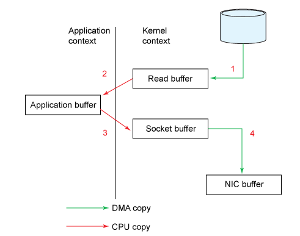
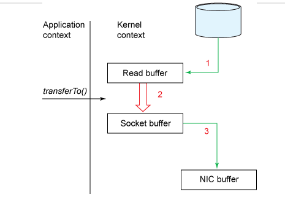

## Zero-Copy

#### 전통적인 데이터 전송 과정

- 디스크에 있는 데이터를 네트워크로 전송하기 위해서는 Kernel 영역과 데이터를 조작하는 Application 영역을 넘나들어야 한다.
- 하지만 Application 영역은 커널에 접근할 수 없다. 따라서 다음과 같은 과정이 필요
  - Kernel 영역에서 Application 영역으로 데이터 복사
  - 복사된 데이터를 Application 영역에서 Kernel 영역으로 복사

- 위 그림을 보면 2번과 3번 데이터 복사는 실제로 필요하지 않음을 알 수 있다.

#### Zero-copy 를 통한 데이터 전송 과정

- Zero-copy 는 이러한 과정을 생략하고 커널(Read Buffer) 에서 커널(Socket Buffer)로 바로 데이터를 전송하여 성능을 높인다.

- C, Go 에서는 Sendfile을 이용해서 Zero copy를 실현할 수 있다.