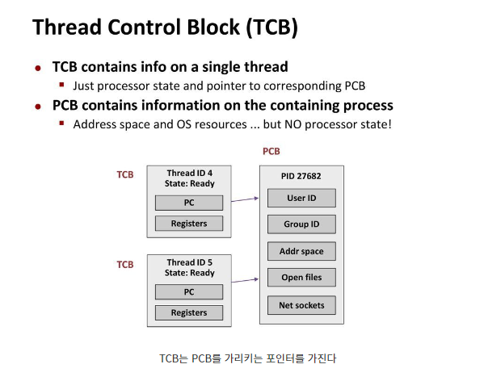

## 문맥 전환(Context Switching)

> 작업의 주체가 현재 Context를 잠시 중단하고 다른 Context를 실행하는 것을 Context Swiching이라 한다.

- CPU의 코어가 1개라면 동시에 하나의 프로세스만 실행이 가능하다. CPU scheduling을 통해서 하나의 CPU를 여러 작업들이 공유할 수 있게 cpu **시간을 나누어** 작업을 수행한다.
- 이때, 프로세서가 지금까지 실행되던 프로세스를 중지하고 다른 프로세스의 `PCB(Process Controll Block)`정보를 바탕으로 프로세스를 실행하는 것을 `Process Context Switching`이라고 한다.
- 동일한 프로세스 속에서 하나의 쓰레드를 중지하고 다른 쓰레드의 `TCB(Thread Control Block)`정보를 바탕으로 쓰레드를 실행하는 것을 `Thread Context Switching`이라고 한다.
- 참고로, Process는 하나이상의 Thread로 동작하기 때문에 `Context Switching의` 최소 단위는 TCB이다.

#### TCB와 PCB

- PCB : Process Controll Block
  - Process ID와 상태, 우선순위, 메모리 정보 등을 저장한다. 멀티스레드가 아닌 멀티프로세스 환경에서는 PCB가 PC와 Register Set 정보도 포함한다. 여기서는 멀티스레드 환경이라 가정한다.
- TCB : Thread Control Block
  - Thread별로 존재하는 자료구조이며, PC와 Register Set(CPU 정보), 그리고 PCB를 가리키는 포인터를 가진다.

#### 참조

- https://velog.io/@curiosity806/Context-Switching%EC%9C%BC%EB%A1%9C-%EC%95%8C%EC%95%84%EB%B3%B4%EB%8A%94-process%EC%99%80-thread

- https://teraphonia.tistory.com/802