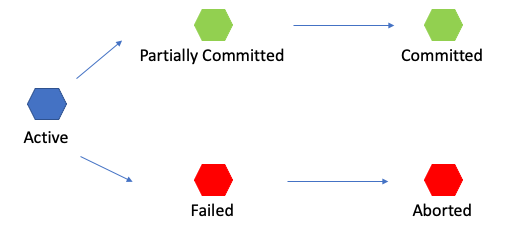

## 트랜잭션 (Transaction)

> 데이터베이스의 상태를 변환시키는 하나의 논리적 기능을 수행하기 위한 작업의 단위 또는 한꺼번에 모두 수행되어야 할 일련의 연산들

#### 특징

- 원자성
  - 트랜잭션이 데이터베이스에 모두 반영되던가, 아니면 전혀 반영되지 않아야 한다.
- 일관성
  - 트랜잭션의 작업 처리 결과가 항상 일관성이 있어야 한다.
- 독립성
  - 둘 이상의 트랜잭션이 동시에 실행되고 있을 경우 어떤 하나의 트랜잭션이라도, 다른 트랜잭션의 연산에 끼어들 수 없다.
- 지속성
  - 트랜잭션이 성공적으로 완료되었을 경우, 결과는 영구적으로 반영되어야 한다.

#### 트랜잭션의 상태

- Active
  - 현재 실행 중인 상태
- Faild
  - 실행 중 오류가 발생하여 중단 된 상태
- Aborted
  - 비정상 종료되어 Rollback이 수행 된 상태
- Partially Committed
  - 마지막 까지 실행되고 Commit이 되기 직전이 상태
- Committed
  - 성공적으로 종료되어 Commit 연산을 실행한 후의 상태

- 간단히 예를 들면
  - 학생 테이블에서 성적과 등수를 함께 수정해야 하는데, 성적만 수정된 상태에서 오류가 발생한다면 성적이 수정된 상태로 반영이 되는 것이 아니라 모두 Rollback 되어 전혀 반영이 되지 않는다.

#### 참조

- https://colinch4.github.io/2021-06-28/%ED%8A%B8%EB%9E%9C%EC%9E%AD%EC%85%98%EC%9D%B4%EB%9E%80/
- https://wonit.tistory.com/462