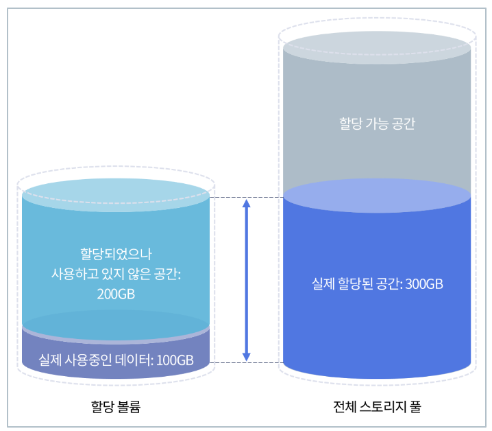
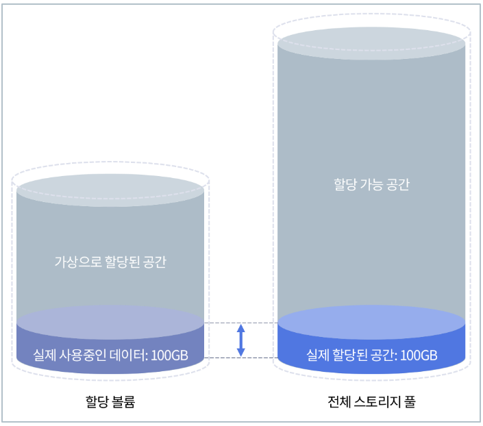

## 프로비저닝(Provisioning)

> 사용자의 요구에 맞게 시스템 자원을 할당, 배치, 배포해두었다가 필요할 때 즉시 사용할 수 있는 상태로 미리 준비해 두는것

#### 프로비저닝의 종류

- 서버 자원 프로비저닝(Server Resource Provisioning)
  - CPU, 메모리, IO 등과 같은 실제 서버의 자원을 할당해주고 운영할 수 있도록 제공해 주는것
- OS 프로비저닝(OS Provisioning)
  - OS를 서버에 설치하고 구성작업을 해서 사용할 수 있도록 제공하는 것
- 소프트웨어 프로비저닝(Software  Provisioning)
  - WAS, DBMS 등의 소프트웨어를 설치하고 세팅하여 실행할 수 있도록 제공하는 것
- 스토리지 프로비저닝(Storage  Provisioning)
  - 데이터를 저장하고 관리할 수 있는 Storage를 제공하는 것
- 계정 프로비저닝(Account  Provisioning)
  - 접근 권한을 가진 계정을 제공해주는 것
- 네트워크 프로비저닝(Network  Provisioning)
  - 사용자, 서버, 컨테이너, IoT 기기가 액세스할 네트워크를 설정하는 것
- 서비스 프로비저닝(Service  Provisioning)
  - 서비스 설정과 관련된 데이터를 관리하는 것

#### 스토리지 프로비저닝

- **Thick Provisioning**

  - 요청한 프로비저닝만큼 자원을 있는 그대로 할당하는 방법
  - 리소스 추가 요청이 들어왔을 때, 추가 요청에 해당하는 리소스를 전부 할당해 준다.
  - 장점
    - 이해하기 쉽다.
    - 설계, 구축, 관리가 편리하다.
  - 단점
    - 리소스 관리의 효율성이 많이 떨어진다.

  

- **Thin Provisioning**

  - 요청한 프로비저닝만큼 리소스를 할당하나 실제로는 물리적 리소스는 일정부분만 주고 나머지는 논리 리소스를 할당한다.
  - 요청한 리소스에 물리적 리소스 할당과 논리적 리소스 할당을 나누어 관리하며 사용자가 물리적 리소스 이상을 사용하면 추가로 물리 리소스를 제공한다.
  - 장점
    - 리소스 관리의 효율성이 높다
  - 단점
    - 물리적 리소스 할당과 논리적 리소스 할당을 나눠야 하기에 설계, 구축, 관리가 까다롭다.
    - 리소스 할당의 수행을 위해 장비의 스펙도 높아야 한다.

  

#### 참고

- https://blue-mina.tistory.com/34
- https://www.redhat.com/ko/topics/automation/what-is-provisioning
- https://jins-dev.tistory.com/entry/%ED%94%84%EB%A1%9C%EB%B9%84%EC%A0%80%EB%8B%9DProvisioning-%EC%9D%B4%EB%9E%80
- https://tech.gluesys.com/blog/2021/03/17/storage_8_intro.html

