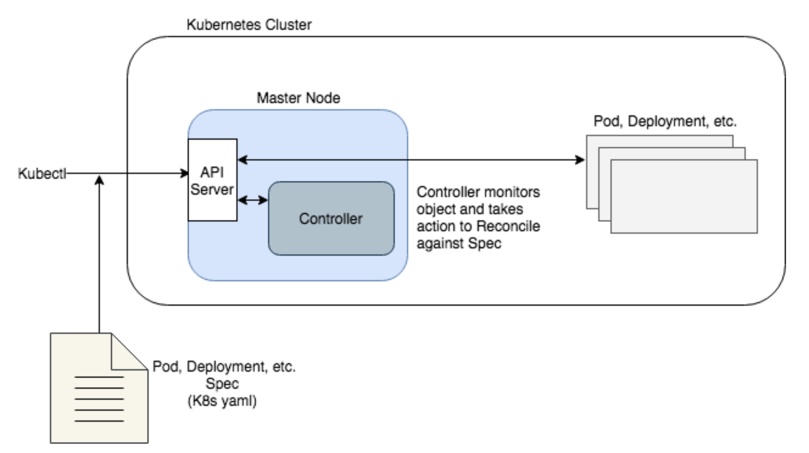
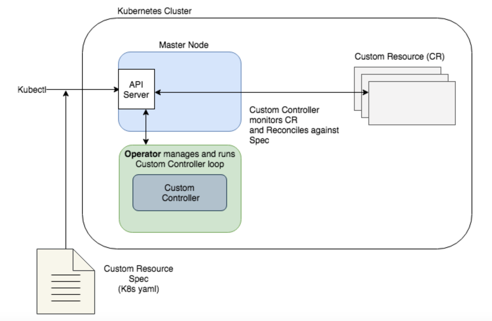

## Operator란?

> CRD(Custom Resource Definitions)와 상호작용하는 정교한 Reconcile 과정을 나타내며, 이를 통해  Operator는 복잡한 어플리케이션 도메인 로직을 캡슐화하여 관리할 수 있다.
>
> k8s Operator는 CR(Custom Resource)의 Controller로 이해하면 쉬울 것 같다.

#### controller란?

- 간단하게 말하면 k8s에서 resource의 상태를 감시하며 원하는 Spec으로 만들어 주는 것을 말한다.
- 컨트롤러는 etcd를 감시하여 선언된 api에 맞게 원하는 상태로 만들어주려고 노력하는 컴포넌트
- pod 을 생성하여 etcd에 넣어놓으면 그 변경을 컨트롤러가 감지하여 컨테이너를 띄워준다.

#### Why Operator?

- 기본적으로 k8s에서 제공되는 Controller의 기능 이외에 더 복잡한 어플리케이션 관리 로직이 필요한 경우가 분명 존재한다. 이 때 필요한 것이 Operator이다.

#### Workflow 비교

- **kubernetes**

- **Operator**

#### Operator 개발 방법

- client-go, controller-runtime, Metacontroller 등의 Go 라이브러리로 밑바닥부터 개발

- 오퍼레이터 프레임워크 사용
  - Operator-SDK를 주로 사용한다.

#### 참고

- https://sphong0417.tistory.com/3