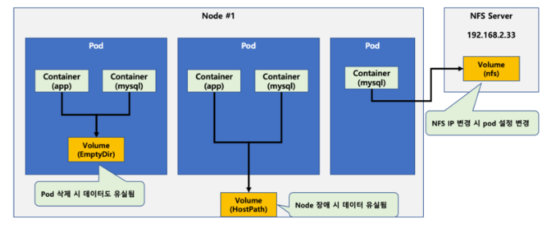
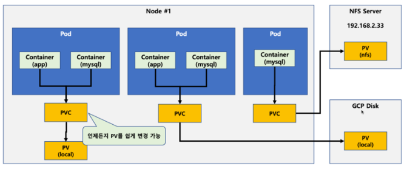
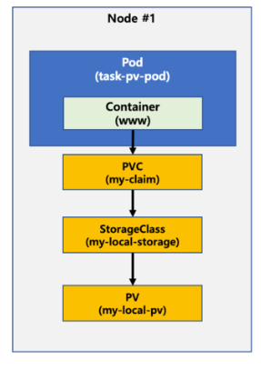

## POD, PVC, PV, Storage Class 정리

#### POD

- kubernetes에서 실행되는 가작 작은 배포 단위
- 하나 이상의 컨테이너 그룹으로 구성되며, 이 컨테이너는 함께 실행되고 동일한 네트워크 및 스토리지 공간을 공유한다.
- Pod는 스토리지를 사용하기 위해 PVC를 요청할 수 있다.

#### PVC(Persistent Volume Clame)

- Pod에서 사용할 수 있는 스토리지 자원의 요청을 나타낸다.
- PVC는 Pod와 독립적으로 존재하며, Pod가 동적으로 할당된 PV와 연결될 때까지 대기한다.
- 스토리지의 크기, 액세스 모드, 볼륨 속성 등을 정의할 수 있다.
- PVC는 특정 StorageClass를 지정하여 PV를 동적으로 할당하도록 지시할 수 있다.

#### PV(Persistent Volume)

- 클러스터에서 스토리지 자원을 나타낸다.
- 클러스터 수준에서 관리되며, 여러 PVC에 바인딩 될 수 있다.
- 스토리지 백엔드, 용량, 엑세스 모드, 지속성 등을 정의한다.
- PV는 PVC 요청에 대한 실제 스토리지를 할당하고, 요청이 만족되면 해당 PVC에 바인딩 된다.

#### Storage Class

- PV를 동적으로 생성하기 위한 스토리지 프로비저닝을 정의하는 오브젝트
- PV를 어떻게 프로비저닝할지, 어떤 종류의 스토리지를 사용할지, 어떤 볼륨 속성을 설정할지를 지정한다.
- PVC는 StorageClass를 참조하여 요청된 스토리지 클래스를 식별하고 해당 StorageClass에 정의된 프로비저닝 규칙을 따른다.
- StorageClass를 사용하면 사용자는 PVC를 생성할 때 수동으로 PV를 만들지 않고도 스토리지를 동적으로 할당할 수 있다.

#### 정리

- Pod는 애플리케이션의 실행 단위
- PVC는 Pod가 요청하는 스토리지 자원을 정의
- PV는 클러스터 수준에서 스토리지 자원을 나타내며, PV에 바인딩 된다.
- StorageClass는 PVC의 요청을 처리하기 위한 프로비저닝 규칙을 정의한다.


### Pod가 볼륨을 지정하는 여러 방식

#### 1. Pod에서 직접 Volume을 지정하는 방식



- 예시 yaml 파일

```yaml
apiVersion: v1
kind: Pod
metadata:
  name: test-pd
spec:
  containers:
  - image: k8s.gcr.io/test-webserver
    name: test-container
    volumeMounts:
    - mountPath: /cache
      name: cache-volume
  volumes:
  - name: cache-volume
    emptyDir: {}
```


#### 2. Pod에서 PV를 활용하는 방식



- 예시 yaml 파일

```yaml
---
apiVersion: v1
kind: PersistentVolume
metadata:
  name: task-pv-volume
  labels:
    type: local
spec:
  storageClassName: manual
  capacity:
    storage: 10Gi
  accessModes:
    - ReadWriteOnce
  hostPath:
    path: "/mnt/data"

---
apiVersion: v1
kind: PersistentVolumeClaim
metadata:
  name: task-pv-claim
spec:
  storageClassName: manual
  accessModes:
    - ReadWriteOnce
  resources:
    requests:
      storage: 3Gi

---
apiVersion: v1
kind: Pod
metadata:
  name: task-pv-pod
spec:
  volumes:
    - name: task-pv-storage
      persistentVolumeClaim:
        claimName: task-pv-claim
  containers:
    - name: task-pv-container
      image: nginx
      ports:
        - containerPort: 80
          name: "http-server"
      volumeMounts:
        - mountPath: "/usr/share/nginx/html"
          name: task-pv-storage
```


#### 3. Storage Class를 활용하는 방식



### 참고

- https://m.blog.naver.com/freepsw/222005161870
- Chat GPT