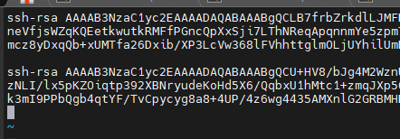
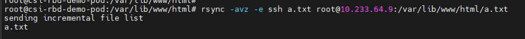

## Pod 에서 Pod로 데이터 보내기 (ssh)

> POD를 2개 띄워서 한 POD 에서 다른 POD 로 file을 전송하는 테스트를 했다. 여기서는 rsync로 진행

container 에서 ssh 통신을 하려면 제약사항이 많다. 하나 하나씩 풀어보자

#### ssh 설치

- image를 생성할 때 ssh 를 설치해야 한다. 
- Dockerfile 예시

```dockerfile
FROM nginx
RUN apt-get update && \
    apt-get install -y openssh-server && \
    mkdir -p /run/sshd
```

- 위 dockerfile 을 이미지로 빌드하고, 그 이미지를 pod 띄우는데 사용하였다.

#### root 권한 주기

- pod를 띄울 때 root 권한을 줘야 한다.

- pod.yaml 예시

```yaml
---
apiVersion: v1
kind: Pod
metadata:
  name: csi-rbd-demo-pod
  labels:
    app: my-app
spec:
  containers:
    - name: web-server
      image: localhost:5000/ssh-nginx:latest
      command: ["/usr/sbin/sshd", "-D", "-e"]
      securityContext:
        privileged: true
      volumeMounts:
        - name: mypvc
          mountPath: /var/lib/www/html
        - name: secret-volume
          mountPath: /etc/secret
  volumes:
    - name: mypvc
      persistentVolumeClaim:
        claimName: rbd-pvc
        readOnly: false
    - name: secret-volume
      secret:
        secretName: test-secret
```

- securityContext : 여기가 root 권한을 주는 부분이다.
- command: ["/usr/sbin/sshd", "-D", "-e"] 여기도 설정해줘야한다.

#### pod 내 ssh 키 생성

- rsync 로 데이터를 보낼 때 원격 노드의 password가 필요한데 pod 내에서는 password 가 뭔지 알수 없어서(방법을 몰라서) public key 를 생성하여 rsync를 하였다.

##### public key 생성 방법

1. 양쪽 Pod에 키 생성

```
# ssh-keygen -t rsa
```

2. pod1 pub key를 pod2로, pod2 pub key를 pod1 으로 복사

```
# cp ~/.ssh/id_rsa.pub ~/.ssh/authorized_keys
# cat ~/.ssh/authorized_keys
```



- 양 쪽 pod 의 `~/.ssh/authorized_keys`  에 이런식으로 들어가 있으면 된다.

3. ssh service 시작

```
# service ssh start
```

- 여기 까지 완료 하면 이제 pod 에서 pod로 rsync 를 할 수 있다.

#### 결과

```
# rsync -avz -e ssh a.txt root@10.233.64.9:/var/lib/www/html/a.txt
```

