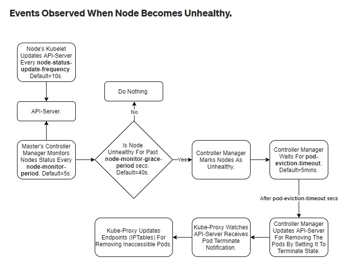

## k8s 분석

#### 문제점

- 노드가 poweroff 됐을 때 다른 노드에서 pod가 다시 살아나는데 까지 10분 이상의 시간이 소요된다.

### TEST

1. Probe (x)
   - Kubernetes Pod의 진단을 담당하는 서비스
   - Probe는 컨테이너에서 kubelet에 의해 주기적으로 수행되는 진단.
   - livenessProbe, readnessProbe, startupProbe
   - **하지만** 노드 전체에 장애가 발생하면 노드에 있는 파드는 유실되며, 레플리케이션 컨트롤러나 그와 유사한 기능을 하는 컨트롤러가 해당 파드를 관리하지 않는 한 새로운 파드로 대체되지 않는다.
   
   
   
2. ReplicationController (x)
   - 노드가 몇 분동안 접속할 수 없는 상태로 유지될 경우 해당 노드에 스케줄된 파드는 Unknown으로 변경된다. 이 때 ReplicationController는 즉시 새 파드를 기동할 것이다.
   - **하지만** Deployment와 마찬가지로 노드가 강제로 종료 되었을 때 다른 node에서 pod가 생기는 데 10분 이상의 시간이 소요 되었음
   
   
   
3. DaemonSet
   - Node당 Pod가 하나씩 생성됨
   - client에서 신호를 보내면 3개의 노드를 순차적으로 접근
   
   

#### Client 에서 한 노드로만 보내는 방법

특정 클라이언트의 연결이 매번 동일한 파드로 전달되도록 하려면, `service.spec.sessionAffinity`를 "ClientIP"로 설정하여 클라이언트의 IP 주소를 기반으로 세션 어피니티(Affinity)를 선택할 수 있다. (기본값은 "None")

`service.spec.sessionAffinityConfig.clientIP.timeoutSeconds`를 적절히 설정하여 최대 세션 고정 시간을 설정할 수도 있다. (기본값은 10800으로, 3시간 / 최대 86400, 24시간)

ex)

```yaml
apiVersion: v1
kind: Service
metadata:
  name: delta-replicator-master
spec:
  type: NodePort
  sessionAffinity: ClientIP
  sessionAffinityConfig:
     clientIP:
     timeoutSeconds: 86400
  ports:
    - name: delta-replicator-mn
      protocol: TCP
      port: 61000
      targetPort: 61000
      nodePort: 31000
  selector:
    dns: delta-replicator-master
---

apiVersion: apps/v1
kind: DaemonSet
metadata:
  name: delta-replicator-master
  labels:
    solution: delta-replicator
spec:
  selector:
    matchLabels:
      name: delta-replicator-master
  template:
    metadata:
      labels:
        name: delta-replicator-master
        dns: delta-replicator-master
    spec:
      restartPolicy: Always
      containers:
        - name: delta-replicator-master
          image: registry.datacommand.co.kr/delta-replicator-master:latest
          imagePullPolicy: Always
          args:
          env:
            - name: CDM_SERVICE_NAME
              value: "delta-replicator-master"
            - name: CDM_SERVICE_ADVERTISE_PORT
              value: "61000"
            - name: CDM_SERVICE_VERSION
              value: "${VERSION:-unknown}"
            - name: CDM_SOLUTION_NAME
              value: "CDM-Disaster-Recovery"
            - name: CDM_SERVICE_DESCRIPTION
              value: "Delta-Replicator::TempVersion"

```

- 참고
  - https://kubernetes.io/ko/docs/concepts/services-networking/service/


##### Test결과

- 연결되어있던 node를 poweroff 시켰을 때 1분 내외에 다른 node에 붙는 것을 확인
- **시간 제한이 있다는 제한사항이 있음(최대 24시간)**


### 다른 방안?

### 

- manifast 파일 수정

  - kube kube-controller-manager.yaml 파일 수정

    - pod-eviction-timeout : 노드에서 포드를 삭제하기 위한 유예 기간 역할을 하는 컨트롤러 관리자, default값이 5분(너무 길다)

    ```yaml
    # kube-controller-manager.yaml
    
    - --pod-eviction-timeout=10s # default 300초
    ```

  - kube-apiserver.yaml 파일 수정

    - default-not-ready-toleration-seconds
    - default-unreachable-toleration-seconds

  ```yaml
  # kube-apiserver.yaml
  
  - --default-not-ready-toleration-seconds=10    # default 300초
  - --default-unreachable-toleration-seconds=10  # default 300초
  ```

  - 결과 : 약 1분 후 살아남

- 참고
  - https://yjwang.tistory.com/102
  - https://medium.com/tailwinds-navigator/kubernetes-tip-how-to-make-kubernetes-react-faster-when-nodes-fail-1e248e184890
