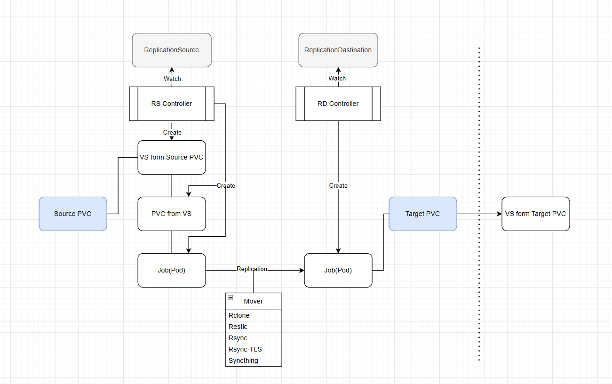

## VolSync란?
> VolSync는 Kubernetes에서 비동기적인 방식으로 **Persistent Volume(PV)** 을 복제하는 **오퍼레이터(operator)**

- VolSync의 특징
  - [공식 문서](https://volsync.readthedocs.io/)
  1. 클러스터 내부 또는 클러스터 간 복제 가능
     - 같은 클러스터 내에서도 PV 복제가 가능하고, 서로 다른 클러스터 간에도 데이터를 복제할 수 있다.
  2. 스토리지 시스템에 독립적
     - 특정 스토리지 유형(Ceph, NFS, EBS 등)에 의존하지 않고, 다양한 스토리지 환경에서 작동할 수 있다.
  3. 원격 복제를 지원하지 않는 스토리지도 복제 가능
     - 일반적으로 원격 복제를 지원하지 않는 스토리지에서도 VolSync를 사용하면 데이터를 복제할 수 있다.
  4. 서로 다른 스토리지 타입(또는 벤더) 간 복제 가능
     - 예를 들어, AWS EBS에서 Ceph RBD로, 또는 NFS에서 다른 블록 스토리지로 데이터를 복제할 수 있다.
  - **주의** : `copyMethod: Snapshot` CSI 스냅샷 기능을 지원해야하기 때문에 지원하는 스토리지에서만 사용 가능

**즉, VolSync는 스토리지 종류와 관계없이 비동기적으로 데이터를 복제할 수 있도록 도와주는 Kubernetes 오퍼레이터라고 할 수 있다.**


### Volsync Mover

| 복제 방식          | 설명                                    | 특징                                                  | 사용 사례                                           |
|----------------|---------------------------------------|-----------------------------------------------------|-------------------------------------------------|
| **Rclone**     | 다양한 클라우드 스토리지를 지원하는 오픈소스 도구           | - 클라우드 스토리지 간 복제<br>- 다양한 스토리지 백엔드 지원<br>- 파일 단위 복제 | - S3, Google Drive, Dropbox 등의 클라우드 스토리지로 백업    |
| **Restic**     | 고속, 효율적인 데이터 백업을 위한 오픈소스 백업 솔루션 | - 다른 방식들과는 다르게 클러스터 간 데이터 동기화 목적이 아닌 데이터 백업이 목적     | - 주기적인 백업 및 데이터 보호                              |
| **Rsync(SSH)** | 가장 일반적인 파일 동기화 도구                     | - 효율적인 파일 복사 및 동기화<br>- 네트워크를 통한 원격 복제              | - 빠른 데이터 동기화가 필요할 때                             |
| **Rsync-TLS**  | Rsync에 TLS 암호화를 추가한 방식                | - Rsync 기능 + 데이터 암호화<br>- 안전한 원격 전송                 | - 보안이 중요한 환경에서 Rsync 사용                         |
| **Syncthing**  | 실시간 동기화가 가능한 P2P 방식 파일 복제 도구          | - 실시간 복제 지원<br>- 변경 감지 기능                           | - 여러 클러스터 간 실시간 데이터 동기화<br/>- 스냅샷 기능은 지원하지 않는다. |


### CopyMethod
- Source
  - CopyMethod에 따른 PiT(Point-in-Time) 사본 생성 방법 지정
    - Clone
        - 소스 PVC를 그대로 복제해여 새로운 볼륨을 생성
    - Direct
        - data mover가 소스 PVC를 직접 사용
    - Snapshot
        - VolumeSnapshot을 생성한 다음, 해당 스냅샷을 사용하여 새 볼륨을 생성
- Destination
  - 각 동기화 반복 끝에 데이터를 보존하는 방법 지정
    - Direct
      - 별도로 Snapshot을 생성하지 않는다.
    - Snapshot
      - 각 반복의 끝에 VolumeSnapshot을 생성

### 주요 리소스 Yaml 파일 (Rsync, Snapshot 방식 기준)
- ReplicationDestination
    ```yaml
    apiVersion: volsync.backube/v1alpha1
    kind: ReplicationDestination
    metadata:
      name: myDest
      namespace: myns
    spec:
      rsync:
        copyMethod: Snapshot
        capacity: 10Gi
        accessModes: ["ReadWriteOnce"]
        storageClassName: my-sc
        volumeSnapshotClassName: my-vsc
    ```
- ReplicationSource
    ```yaml
    apiVersion: volsync.backube/v1alpha1
    kind: ReplicationSource
    metadata:
      name: mySource
      namespace: source
    spec:
      sourcePVC: mysql-pv-claim
      trigger:
        schedule: "*/5 * * * *"
      rsync:
        sshKeys: volsync-rsync-dest-src-database-destination
        address: my.host.com
        copyMethod: Snapshot
    ```
  
    - 추가 옵션
      - destinationPVC : 자동으로 PVC를 생성하지 않고 기존에 있는 PVC를 지정할 수 있다.
      - cleanupTempPVC : 동기화가 완료되면 PVC를 삭제 (destinationPVC가 지정되어있으면 이 옵션은 무시)
      - sshKeys : 소스와의 연결을 인증하기 위한 ssh 키가 포함된 Secret의 이름
      - serviceType : volsync는 ReplicationSource와 ReplicationDestination 간의 통신을 위해 Service를 생성하는데 그 Service가 어떤 타입으로 생성될지 결정 (ClusterIP or LoadBalancer)
      - port : ssh를 통해 연결하는 데 사용되는 TCP 포트 번호

### 복제 흐름

1. 타겟에 `ReplicationDestination` CR 생성
   - 사용할 PVC를 지정하지 않으면 PVC가 자동으로 생성된다
2. 소스에 `ReplicationSource` CR 생성
   - 소스 PVC의 정보, 복제 방식, 타겟 노드 정보 등이 담겨있다.
3. 소스, 타겟에 복제 경로 생성
   - 소스 : VolumeSnapshot 생성 -> PVC 생성 -> Job(Pod) 생성
   - 타겟 : Job(Pod) 생성
4. 복제 시작
   - Job Command에 입력된 Script 대로 Replication 실행
5. 타겟쪽 VolumeSnapshot 생성
6. Clean UP (리소스 정리)
   - 소스쪽 VolumeSnapshot, Job
   - 타겟쪽 Job

### 그 외 주요 기능

- scheduler

  | 표현식 | 설명 |
  |--------|------|
  | `0 * * * *` | 매시간 0분마다 실행 |
  | `0 3 * * *` | 매일 새벽 3시에 실행 |
  | `0 3 * * 1` | 매주 월요일 새벽 3시에 실행 |
  | `0 3 1 * *` | 매월 1일 새벽 3시에 실행 |
  | `*/30 * * * *` | 30분마다 실행 |

```yaml
apiVersion: volsync.backube/v1alpha1
kind: ReplicationSource
metadata:
  name: mySource
  namespace: myns
spec:
  rsync:
    schedule: "0 2 * * *"
```

- Metrics & monitoring
  - Persistent Volume(PV) 복제 및 백업의 상태를 추적하고 관리할 수 있도록 모니터링 기능을 제공
  - 이를 통해 백업/복제 작업의 성공 여부, 수행 시간, 스토리지 사용량 등을 실시간으로 확인할 수 있다.

    | Metric 이름 | 설명          |
    |------------|-------------|
    | `volsync_missed_intervals_total` | 실패한 복제 작업 수 |
    | `volsync_sync_duration_seconds` | 볼륨 동기화 간격   |
    | `volsync_volume_out_of_sync` | 동기화 실패 상태   |

    