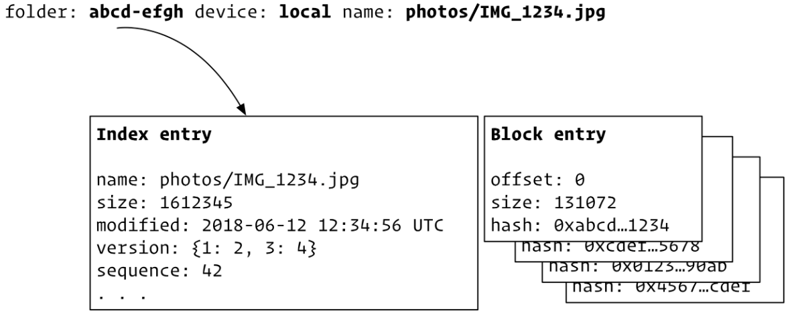

## Syncthing Scan 동작 과정

### Index Database
- Syncthing 은 각 dir, file, symlink 의 정보를 `index-*.db` 파일에 저장한다.
- `index-*.db`에는 파일 별로 name, size, modified, version, seq 등의 정보와 블록 목록이 들어있다.

    
- 일반적으로 블록의 크기는 128KiB 이며 파일 크기에 따라 더 커질 수 있다. (마지막 블록 size는 일반적으로 더 작다.)
### Scanning 3단계 과정
1. Walk the Folder
   - 디렉터리를 탐색하면서 찾은 각 항목(파일 등)을 index 파일의 항복과 비교하고, 다른 항목이 있으면 Queue에 추가
   - 파일 대부분의 메타데이터와 데이터베이스가 RAM에 캐시되어 있으면 비교 작업은 빠르게 진행된다.
     - 그렇지 않고 폴더가 큰 경우는 시간이 오래 걸리고 많은 I/O가 발생할 수 있다.
2. Hash the Files
   - 1단계에서 Queue 에 넣은 파일을 해시한다.
   - 
3. Scan for Deletes