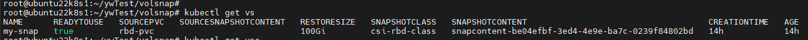
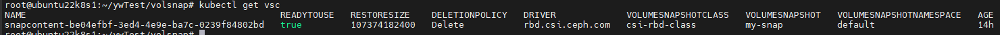
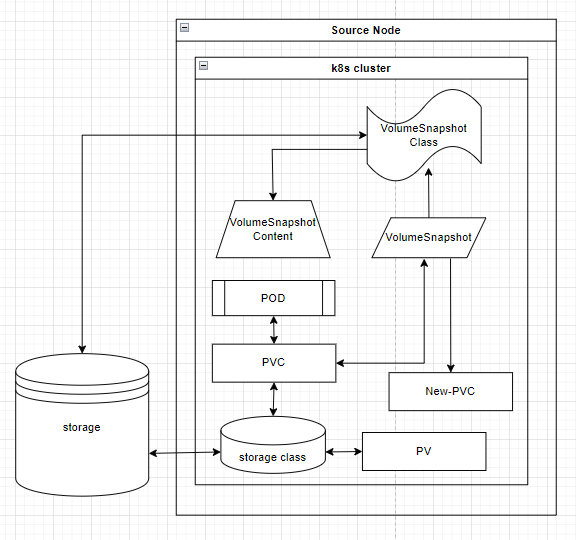

## 볼륨 스냅샷 (Volume Snapshot)

#### VolumeSnapshotContent 와 VolumeSnapshot

- **VolumeSnapshot** 
  - 실제 스냅샷 생성을 요청하는 오브젝트로, 사용자가 생성하게 되는 메타데이터
- **VolumeSnapshotContent**
  - 실제 생성된 스냅샷의 메타데이터를 제공
  - 메타데이터에는 스냅샷 내용, 접근 가능한 위치, 스냅샷의 소스, 어떤 `VolumeSnapshotClass`를 사용했는지 등이 적혀있다.
- **VolumeSnapshotClass**
  - 각 스냅샷 생성 시 CSI 드라이버와 스냅샷 생성에 대한 파라미터를 정의한다.
  - 스토리지 클래스에 대응하는 개념
- `VolumeSnapshotContent` 과 `VolumeSnapshot` 의 관계는 API 리소스`PV` 와 `PVC`의 관계와 유사하다. (완전히 같은 개념은 아님)

>  즉, `VolumeSnapshot` 는 `VolumeSnapshotContent` 을 참조하여 스냅샷을 생성하고 관리한다. `VolumeSnapshot`은 `PVC`와 1:1 관계를 가지며 `PVC`의 상태와 데이터를 스냅샷으로 캡처하여 `VolumeSnapshotContent`에 저장한다. 이렇게 생성된 스냅샷은 필요에 따라 복원하거나 다른 환경으로 이동할 수 있다.

- 글로는 잘 이해가 안되서 스냅샷을 생성하고 복원하는 과정을 따라하며 이해해 보았다.

### Volume Snapshot 사용 하기

- 예시에서 사용되는 yaml 파일은 [문서](https://cloud.google.com/kubernetes-engine/docs/how-to/persistent-volumes/volume-snapshots?hl=ko#v1)를 참조 하였습니다.
- 다음 과정을 진행하기 이전에 `VolumeSnapshot`, `VolumeSnapshotContent`, `VolumeSnapshotClass` CRD 를 k8s 클러스터에 등록해야 합니다.

```
## CRD 생성 버전에 맞게 apply 해야 한다.
kubectl apply -f https://raw.githubusercontent.com/kubernetes-csi/external-snapshotter/release-6.3/client/config/crd/snapshot.storage.k8s.io_volumesnapshotclasses.yaml
kubectl apply -f https://raw.githubusercontent.com/kubernetes-csi/external-snapshotter/release-6.3/client/config/crd/snapshot.storage.k8s.io_volumesnapshotcontents.yaml
kubectl apply -f https://raw.githubusercontent.com/kubernetes-csi/external-snapshotter/release-6.3/client/config/crd/snapshot.storage.k8s.io_volumesnapshots.yaml

kubectl apply -f https://raw.githubusercontent.com/kubernetes-csi/external-snapshotter/master/client/config/crd/snapshot.storage.k8s.io_volumesnapshotclasses.yaml
kubectl apply -f https://raw.githubusercontent.com/kubernetes-csi/external-snapshotter/master/client/config/crd/snapshot.storage.k8s.io_volumesnapshotcontents.yaml
kubectl apply -f https://raw.githubusercontent.com/kubernetes-csi/external-snapshotter/master/client/config/crd/snapshot.storage.k8s.io_volumesnapshots.yaml

## 컨트롤러 생성
kubectl apply -f https://raw.githubusercontent.com/kubernetes-csi/external-snapshotter/release-6.3/deploy/kubernetes/snapshot-controller/rbac-snapshot-controller.yaml
kubectl apply -f https://raw.githubusercontent.com/kubernetes-csi/external-snapshotter/release-6.3/deploy/kubernetes/snapshot-controller/setup-snapshot-controller.yaml


kubectl apply -f https://raw.githubusercontent.com/kubernetes-csi/external-snapshotter/master/deploy/kubernetes/snapshot-controller/rbac-snapshot-controller.yaml
kubectl apply -f https://raw.githubusercontent.com/kubernetes-csi/external-snapshotter/master/deploy/kubernetes/snapshot-controller/setup-snapshot-controller.yaml

```

- CRD 및 컨트롤러 생성 확인

```
# kubectl get crd
volumesnapshotclasses.snapshot.storage.k8s.io    2023-06-30T07:56:21Z
volumesnapshotcontents.snapshot.storage.k8s.io   2023-06-30T07:56:22Z
volumesnapshots.snapshot.storage.k8s.io          2023-06-30T07:56:23Z

# kubectl get pods -n kube-system | grep snapshot
snapshot-controller-85f68864bb-stt97          1/1     Running            0                 61s
snapshot-controller-85f68864bb-xbqdc          1/1     Running            0                 61s
```


### VolumeSnapshot 생성

> rbd.csi.ceph.com 인 csi driver 에서 진행하였고, Storageclass 등 ceph 관련 리소스는 미리 생성되어 있다고 가정한다.

1. PVC 생성

```yaml
apiVersion: v1
kind: PersistentVolumeClaim
metadata:
  name: rbd-pvc
spec:
  accessModes:
    - ReadWriteOnce
  volumeMode: Filesystem
  resources:
    requests:
      storage: 100Gi
  storageClassName: csi-rbd-sc
```

```
# kubectl apply -f my-pvc.yaml
```

2. POD 생성

```yaml
---
apiVersion: v1
kind: Pod
metadata:
  name: csi-rbd-demo-pod
  labels:
    app: my-app
spec:
  containers:
    - name: rbd-csi
      image: nginx
      volumeMounts:
        - name: mypvc
          mountPath: /var/lib/www/html
  volumes:
    - name: mypvc
      persistentVolumeClaim:
        claimName: rbd-pvc
        readOnly: false
```

```
# kubectl apply -f my-pod.yaml
```

3. VolumeSnapshotClass 객체 생성

```yaml
apiVersion: snapshot.storage.k8s.io/v1
kind: VolumeSnapshotClass
metadata:
  name: csi-rbd-class
  annotations:
    snapshot.storage.kubernetes.io/is-default-class: "true"
driver: rbd.csi.ceph.com
deletionPolicy: Delete
parameters:
  clusterID: 47891e81-1fd8-4385-84b9-b964d077f1a9
  pool: kubernetes
  userId: admin
  userName: admin
  userKey: AQAXVu5hbYDiDhAA05jFqNeg0uSTx5jRQXy40A==
  csi.storage.k8s.io/snapshotter-secret-name: csi-rbd-secret
  csi.storage.k8s.io/snapshotter-secret-namespace: default
```

```
# kubectl apply -f volumesnapshotclass.yaml
```

4.  VolumeSnapshot 생성

```yaml
apiVersion: snapshot.storage.k8s.io/v1
kind: VolumeSnapshot
metadata:
  name: my-snap
spec:
  volumeSnapshotClassName: csi-rbd-class
  source:
    persistentVolumeClaimName: rbd-pvc
```

```
# kubectl apply -f volumesnapshot.yaml
```

- `VolumeSnapshot`을 생성하면 `volumeSnapshotClass`를 통해 `VolumeSnapshotContent` 가 자동으로 생성된다.
- `VolumeSnapshot` 을 생성 한 시점의 스냅샷 메타 데이터가 `VolumeSnapshotContent` 에 저장된다.

##### 볼륨 스냅샷 및 볼륨 스냅샷 컨텐츠 생성 결과

- 볼륨 스냅샷



- 볼륨 스냅샷 컨텐츠



### VolumeSnapshot 복원

`PVC`의 `VolumeSnapshot`을 참조하여 기존 볼륨의 데이터가 포함된 새 볼륨을 프로비저닝하거나 스냅샷으로 캡처한 상태로 볼륨을 복원할 수 있다.

1. 복원할 pvc 생성

```yaml
apiVersion: v1
kind: PersistentVolumeClaim
metadata:
  name: pvc-restore
spec:
  dataSource:
    name: my-snap
    kind: VolumeSnapshot
    apiGroup: snapshot.storage.k8s.io
  accessModes:
    - ReadWriteOnce
  volumeMode: Filesystem
  resources:
    requests:
      storage: 100Gi
  storageClassName: csi-rbd-sc
```

```
# kubectl apply -f pvc-restore.yaml
```

2. Pod 수정 or 새로운 Pod 생성

```yaml
...
volumes:
- name: my-volume
  persistentVolumeClaim:
    claimName: pvc-restore
```

```
# kubectl apply -f my-pod.yaml
```

- volume 부분을 업데이트 한다.


여기까지 완료 하면 VolumeSnapshot 을 생성한 시점의 데이터가 POD에 담겨있는 것을 확인 할 수 있다.

### 구조



- 이런 구조이지 않을까 하고 생각하며 그려보았다.


CSI 볼륨 스냅샷을 사용하여 앱 개발자는 다음을 수행할 수 있습니다.

- 애플리케이션 또는 클러스터 수준 스토리지 백업 솔루션을 개발하기 위한 빌딩 블록으로 볼륨 스냅샷을 사용합니다.
- 이전 개발 버전으로 빠르게 롤백합니다.
- 매번 전체 사본을 만들지 않아도 되므로 스토리지를 보다 효율적으로 사용할 수 있습니다.