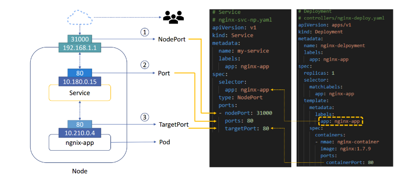
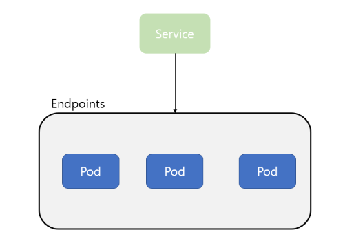

## 쿠버네티스 Service 개념과 종류

### 학습 내용

- 서비스 개념
- 서비스 타입
- 서비스 사용하기
- 헤드리스 서비스
- kube-proxy


### kubernetes Service 개념

- Pod의 논리적 집합이며 어떻게 접근 할지에 대한 정책을 정의해 놓은 것

- 동일한 서비스를 제공하는 Pod그룹의 단일 진입점을 제공

  - 파드들을 하나의 IP로 묶어서 관리 (로드 밸런서 IP가 만들어진다. virture ip  혹은 로드밸런서 ip)
  - Service-definition

  ```
  apiVersion: v1
  kind: Service
  metadata:
  	name:
  ```


### Service Type

- 4가지 Type 지원
  - ClusterIP
    - Pod그룹의 단일 진입점(Virtual IP) 생성
  - NodePort
    - ClusterIP가 생성된 후
    - 모든 Worker Node에 외부에서 접속가능 한 포트가 예약
  - LoadBalancer
    - 클라우드 인프라스트럭처(AWS, Azure, GCP 등)나 오픈스택 클라우드에 적용
    - LoadBalancer를 자동으로 프로비전하는 기능 지원
  - ExternalName
    - 클러스터 안에서 외부에 접속 시 사용할 도메인을 등록해서 사용
    - 클러스터 도메인이 실제 외부 도메인으로 치환되어 동작


### Service 사용

- Service 생성

```yaml
apiVersion: v1
kind: Service
metadata:
  name: my-service
  labels:
    app: nginx-app
spec:
  selector:
    app: nginx-app
  type: NodePort
  ports:
  - nodePort: 31000
    port: 80
    targetPort: 80
```


- pod 생성

```yaml
apiVersion: apps/v1
kind: Deployment
matadata:
  name: nginx-deployment
  labels:
    app: nginx-app
spec:
  replicas: 3
  selector:
    matchLabels:
      app: nginx-app
  template:
    metadata:
      labels:
        app: nginx-app
    spec:
      containers:
      - name: nginx-container
        image: nginx:1.7.9
        port:
          containerPort: 80
```




### Endpoints

- Service는 label seletor을 사용해 해당하는 Pod를 서비스에 매칭 시키는데, 이게 가능한 이유는 Endpoints가 있기 때문이다.
- 서비스는 이 Endpoints에 매핑된 Pod들의 IP정보를 가지고 Pod에게 트래픽을 전달한다.
- Endpoints는 Service가 트래픽을 전달하고자 하는 Pod의 집합이다.



- Endpoint Controller
  - Endpoint는 Endpoint Controller에 의해 관리되는데, 이 Endpoint Controller는 마스터 노드의 Controller Manager에 의해 관리된다.
  - Endpoint Controller는 API Server를 감시하고 있다가 Service에 유효한 Pod가 추가되면 해당 Pod를 Endpoints 목록에 추가하고, Pod가 삭제되면 해당 Pod를 Endpoint 목록에서 삭제 한다.

#### 참조

- https://yoonchang.tistory.com/49

- https://yoo11052.tistory.com/193
