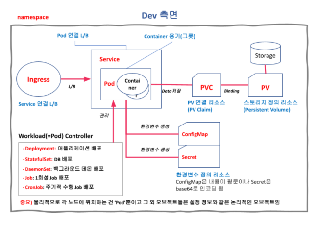

## 쿠버네티스 리소스

> - 리소스는 쿠버네티스 클러스터 내에서 생성하고 관리하는 대상을 의미
>
> - Pod, ReplicaSet, Deployment, Service, configurations 등이 리소스에 해당한다.

- 리소스는 쿠버네티스의 API 오브젝트로 정의된다. API 오브젝트는 YAML 또는 JSON 포맷으로 표현 될 수 있으며, 이를 통해 클러스터에 대한 구성 및 설정을 수행 할 수 있다.
- 리소스는 쿠버네티스의 핵심 개념 중 하나이며, 쿠버네티스 클러스터에서 어떤 작업을 수행하기 위해서는 반드시 적절한 리소스를 생성해야 한다.

### 가장 기본적으로 사용되는 리소스

#### Pod

- 쿠버네티스에서 가장 작은 배포 단위
  - 모든 리소스 중 물리적으로 각 노드에 생성되는 것은 파드 밖에 없다.
- 하나 이상의 컨테이너를 묶어서 관리
- 컨테이너와 함께 배치되는 볼륨, 서비스 계층, IP 등의 네트워크를 포함

#### ReplicaSet

- Pod을 복제하는 역할
- Pod을 자동으로 생성하거나 삭제하여 Pod의 개수를 일정하게 유지

#### Deployment

- ReplicaSet의 버전 관리 기능 추가
- Deployment의 변경 사항이 적용되면 새로운 ReplicaSet을 만들어서 새 버전의 Pod으로 교체

#### Service

- 여러 개의 Pod에 대한 로드 밸런싱을 지원하는 추상적인 리소스
- 각 Pod에 직접 접근하지 않고 Service를 통해 접근
- Service는 Pod의 IP 주소와 포트 정보를 가지고 있으며, 요청을 적절한 Pod로 전달

#### ConfigMap

- 설정 정보를 저장하는 리소스
- 설정 정보는 key-value 쌍으로 구성되며, Pod에서 환경 변수나 파일로 사용될 수 있음

#### Secret

- 보안 정보를 저장하는 리소스
- 설정 정보는 key-value 쌍으로 구성되며, Base64로 인코딩된 형태로 저장됨
- Pod에서 환경 변수나 파일로 사용될 수 있음

##### ConfigMap과 Secret

- 어플리케이션을 개발할 때 유연한 개발을 위해 환경변수를 많이 사용하는데, 쿠버네티스에서 환경변수를 만들어주는 리소스가 ConfigMap과 Secret이다.

- 차이점
  - ConfitMap은 환경변수의 값을 평문으로 정의하고 Secret은 base64로 암호화 해서 정의한다.

#### PersistentVolume

- Pod에서 사용할 수 있는 디스크를 제공하는 리소스
- 여러 Pod에서 공유 가능
- 클러스터에 속한 노드의 스토리지와 연결하여 사용

#### PersistentVolumeClaim

- PersistentVolume을 사용하기 위한 요청을 정의하는 리소스
- Pod에서 사용할 용량과 같은 디스크 요구 사항을 지정하고, 이를 만족하는 PersistentVolume을 찾아 바인딩함

##### PVC와 PV

- PVC는 데이터 저장소 사용 요청서이고, PV는 실제 데이터 저장소 정의 리소스이다.
- 파드가 데이터 저장소를 연결하려면 PVC와 연결 되어야 하고, PVC와 PV가 연결(Bind) 되어야 한다.


### Pod와 다른 리소스의 차이

- 모든 쿠버네티스 리소스 중 물리적으로 각 노드에 생성되는 것은 **파드**밖에 없다.
- 다른 리소스들은 특정 노드에 생성되는 것이 아니라 환경설정과 같은 **논리적인 리소스**이다.

#### 직접 확인해보자

```
# kubectl get pod -owide

Node 열에 파드가 어떤 노드에 생성되었는지 확인할 수 있다.
```

```
# kubectl get service -owide

노드 정보가 나오지 않는다.
```


### 대략적인 구조




#### 참고

- https://happycloud-lee.tistory.com/248

