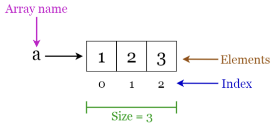
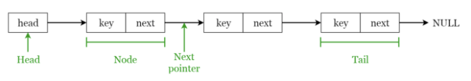
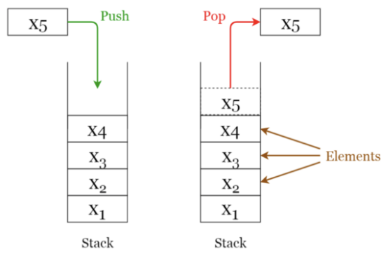
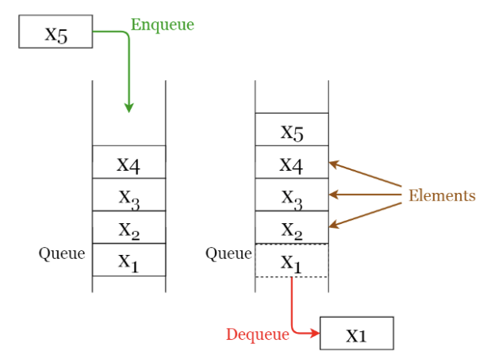
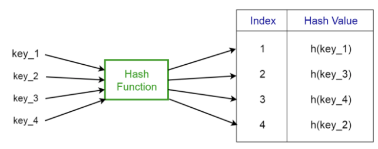
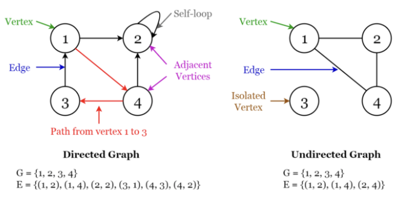
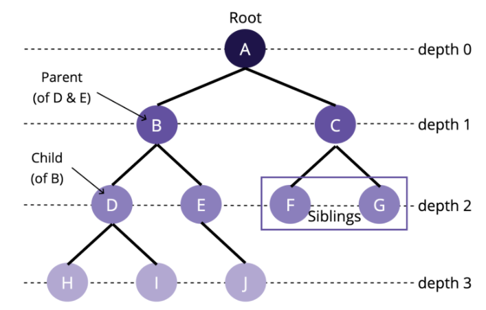
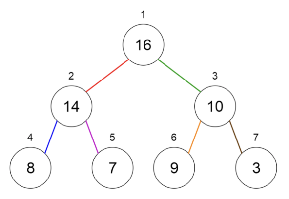

## 필수 자료 구조

#### 배열(Array)

- 가장 기본적인 데이터 구조
- 생성시 설정된 셀의 수가 고정되고, 각 셀에는 인덱스 번호가 부여된다.
- 배열을 활용 시 인덱스를 통해 해당 셀 안에 있는 데이터에 접근

##### 장점

- 바로 만들어서 활용하기 쉽다.
- 더 복잡한 자료구조의 기초가 될 수 있다.
- 원하는 데이터를 효율적으로 탐색/가져올 수 있다.
- 정렬에 용이하다.

##### 단점

- 데이터를 저장할 수 있는 메모리 크기가 고정되어 있다.
- 데이터 추가/삭제 방법이 비효율적이다.
- 구조 재구성 시 정렬하는 방식이 비효율적이다.

#### 사용

- 삽입 정렬, 빠른 정렬, 버블 정렬 및 병합 정렬과 같은 다양한 정렬 알고리즘에 사용
- 배열 목록, 힙, 해시 테이블, 벡터 및 행렬과 같은 기타 데이터 구조를 구축하기 위한 빌딩 블록으로 사용

#### 연결 리스트(Linked List)

- 메모리에 있는 데이터의 물리적 배치를 사용하지 않는 구조
- 인덱스나 위치보다 참조 시스템을 사용
- 각 요소는 **노드**에 저장되고 다음 노드 연결에 대한 포인터 또는 주소가 포함된 또 다른 노드에 저장된다.
- 모든 노드가 연결될 때까지 반복, 노드의 연결로 이루어진 자료 구조

##### 장점

- 새로운 요소들의 추가 및 삭제가 용이하고 효율적이다
- 배열처럼 메모리에 연속적으로 위치하지 않는다
- 배열처럼 구조의 재구성이 필요없다
- 동적인 메모리 크기
- 메모리를 더 효율적으로 쓸 수 있기 때문에 대용량 데이터 처리 적합

##### 단점

- 배열보다 메모리를 더 사용한다
- 처음부터 끝까지 순회하기 때문에 원하는 값을 비효율적으로 검색/가져온다
- 노드를 반대 방향으로 검색할 때 비효율적이다 (이중 연결 리스트의 경우)

##### 사용

- 이미지 뷰어, 갤러리, 음악플레이어
- 데이터를 연속적으로 빠르게 삽입/제거가 필요할 때

#### 스택(Stack)

- 순서가 보존되는 선형 데이터 구조
- LIFO(Last In First Out) 매커니즘을 가진다.

##### 장점

- 동적인 메모리 크기
- 데이터를 받는 순서대로 정렬된다
- 빠른 런타임 (runtime)

##### 단점

- 가장 최신 요소만 가져온다
- 한번에 하나의 데이터만 처리 가능하다

##### 사용

- 가장 마지막으로 입력된 것을 순차적으로 바로 처리하고 싶을 때
- 브라우저의 뒤로가기
- 실행 취소
- 재귀

#### 큐(Queue)

- 스택과 비슷하지만 FIFO(First In First Out) 구조

**장점**

- 동적인 메모리 크기
- 데이터를 받는 순서대로 정렬된다
- 빠른 런타임 (runtime)

**단점**

- 가장 오래된 요소만 가져온다
- 한번에 하나의 데이터만 처리 가능하다

**사용**

- 반복적이고 자주 받는 데이터를 비동기적으로 처리 할 때 효율적
- 음성 데이터 처럼 순서에 민감한 데이터를 처리 할 때
- 프린트 대기열처럼 가장 먼저 입력 받은 데이터를 먼저 처리해야 할 때
- 캐시(Cache) 구현

#### 해시 테이블(Hash table)

- 대량의 정보를 저장하고 특정 요소를 효율적으로 검색할 수 있는 복잡한 데이터 구조
- 테이블 내에 더 작은 서브그룹인 버킷(bucket)에 `key/value` 쌍을 저장한다.
  - 키(key)는 검색 시 사용되는 문자열, 값(value)은 해당 키와 쌍을 이룬 데이터
- 키를 저장할 때 메모리 공간을 덜 사용할 수 있도록, 키를 **해시 함수** 라는 함수를 통해 특정 숫자값으로 변환 한다.
- 필요할 때만 메모리 크기를 늘리고, 가능한 작게 유지한다.

**장점**

- 새로운 요소들의 추가/삭제가 용이하고 효율적이다
- 원하는 값의 검색/가져오기가 빠르고 효율적이다
- 동적인 메모리 크기 (그러나 직접 크기를 늘리거나 줄여야 한다)

**단점**

- 충돌이 일어날 수 있다 (입력된 키의 해시값이 이미 데이터가 저장된 버킷을 가리킬 수 있다)
- 충돌이 자주 일어날 수 있으며 해시함수의 정비가 필요한 경우가 많다.

**사용**

- 데이터베이스 : 주소 찾기, 이름 찾기, 번호 찾기
- 사용자 로그인 인증

#### 그래프(Graph)

- 그래프는 단순히 노드(Node) 사이에 엣지(edge)가 있는 `collection` 이다.
- 그래프는 `방향(directed)` 또는 `무방향(undirected)`이 될 수 있다.
  - `directed`는 일방통행, `undirected`는 양방향 도로

- **장점**

  - 새로운 요소들의 추가/삭제가 용이하고 효율적이다
  - 구조의 응용이 가능하다

  **단점**

  - 충돌이 일어날 수 있다 (입력된 키의 해시값이 이미 데이터가 저장된 버킷을 가리킬 수 있다)

  **사용**

  - 데이터베이스 : 주소 찾기, 이름 찾기, 번호 찾기
  - 사용자 로그인 인증

#### 트리(Tree)

- 노드로 구성된 계층적 자료구조.
- 최상위 노드(루트)를 만들고, 루트 노드의 `child`를 추가하고, 그 `child`에 `child`를 추가하는 방식으로 트리 구조를 구현한다.

트리 구조와 관련하여 반드시 알아야 할 개념들:

- A, B, C, D 등 트리의 구성요소를 **노드(node)** 라고 한다.
- 위 그림의 A처럼, 트리 구조에서 최상위에 존재하는 노드를 **root**라고 한다.
- 루트를 기준으로, 다른 노드로의 접근하기 위한 거리를 **depth** 라고 한다.
- 같은 부모를 가지면서 같은 depth에 존재하는 노드들은 **sibling** 관계에 있다.
- 그림에서 A는 B와 C의 **부모(parent)** 이고, B와 C는 A의 **자식(child)이**다.
- 노드와 노드를 잇는 선을 **edge** 라고 한다.
- 자식이 없는 노드는 **leaf** 라고 한다.

#### 힙(Heap)

- Binary Tree(이진 트리)
- 최소 힙 
  - 부모의 키 값이 자식의 키 값보다 작거나 같다.
  - 루트 노드의 키 값이 트리의 최솟값
- 최대 힙
  - 부모의 키 값이 자식의 키 값보다 크거나 같다.
  - 루트 노드의 키 값이 트리의 최댓값

##### 사용

- 힙 정렬 알고리즘
- 우선순위 큐